# Sir John Donne Re-enactment

[Live Site](https://david-cb-uk.github.io/sir-john-donne-reenactment/) | [Repository](https://github.com/David-CB-UK/sir-john-donne-reenactment)

<!-- TODO: change mockup image -->
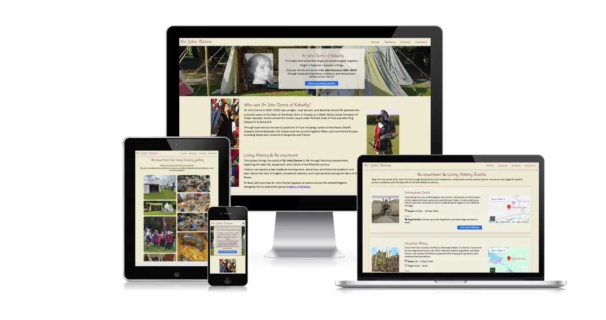  

<details><summary> View homepage mockup (Click to expand)</summary>
<!-- TODO: change mockup image -->
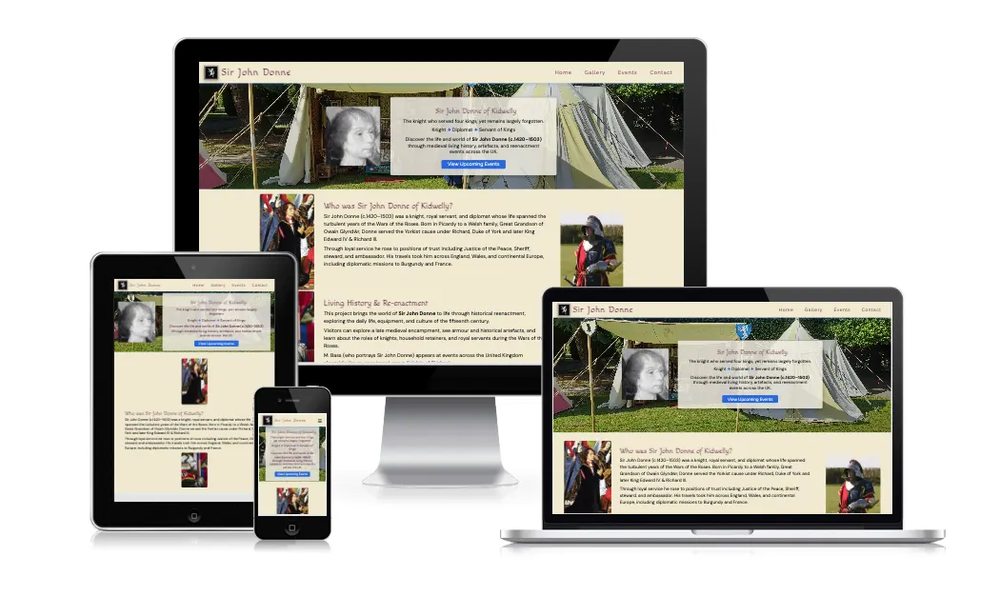  
*Showing the landing / home page*
</details>

## Table of Contents

1. [Project Overview](#project-overview)
2. [User Experience](#user-experience)
3. [Design](#design)
4. [Features](#features)
5. [Technologies Used](#technologies-used)
6. [Project Structure](#project-structure)
7. [Testing](#testing)
8. [Deployment](#deployment)
9. [Credits](#credits)

---

## Project Overview

The Sir John Donne re-enactment website is designed to support historical education and public engagement through the recreation of a 15th-century living history display. 
The site provides visitors with information about Sir John Donne, the historical context of the re-enactment, and details about the objects and displays used within the re-enactment or living-history tent.

The website is aimed at visitors attending re-enactment events, students interested in medieval history, and members of the public who want to learn more about Sir John Donne and historical re-enactment.

The site helps users quickly find relevant information about the re-enactment, understand the historical context of the displays, and discover how to engage further with the project.

Users interact with the website by navigating through clearly organised sections that explain the re-enactment setup, provide historical background, and offer additional information about the items displayed within the living-history tent.

The goal of the project is to create a **simple, accessible**, and **responsive** website that works across desktop, tablet, and mobile devices.

[Back to top](#sir-john-donne-re-enactment) <!-- add space below so not large size -->

---

## User Experience

<!-- TODO: Add responsive mockup image -->
### Target Audience

- Visitors attending historical re-enactment events
- Students and educators interested in early modern history
- Members of the public interested in historical interpretation

<!-- TODO: Add responsive mockup image -->
### First Time Visitor Goals

- Understand the purpose of the site immediately
- Navigate easily between pages
- Access important information quickly
- Learn about Sir John Donne
- Understand the historical items displayed in the Re-enactment tent
- Discover further resources about Re-enactment and historical interpretation

<!-- TODO: Add responsive mockup image -->
### Returning Visitor Goals

- Find new or updated information
- Navigate directly to sections of interest
- Find out about future events
- Know how to contact site owner / historical re-enactment group

<!-- TODO: Add responsive mockup image -->
### Site Owner Goals

- Present information clearly
- Provide a clean and responsive design
- Ensure accessibility across devices
- Provide educational material about Sir John Donne
- Support public engagement at Re-enactment events
- Offer an accessible digital resource that complements the physical Re-enactment display

[Back to top](#sir-john-donne-re-enactment)

---

## Design

### The Colour scheme

### Primary Colour – #5F1A37  
The primary colour is a deep burgundy (#5F1A37), used for headings and key interface elements. This colour provides strong contrast against the background, improving readability while also reinforcing the historical theme of the website.

### Secondary Colour – #F1E9D2  
The secondary colour is a parchment-style beige (#F1E9D2), used as the main background colour. This creates a neutral and visually comfortable base, supporting accessibility by reducing eye strain and allowing content to remain clear and legible.

### Accent Colour – #167FCA  
An accent colour of blue (#066DDC) is used for interactive elements such as buttons, navigation highlights, and hover states. This ensures that clickable elements are easily identifiable, improving usability and user experience.
Originally #066DDC was chosen, however when I was given the image that was made into the favicon [Wolf favicon image](assets/favicon/favicon.svg) it was decided that we would use that 'color' throughout as a more accurate colour.

### Colour Scheme Rationale  
The colour scheme was chosen to create a clear and accessible visual design, with sufficient contrast between foreground and background elements to support readability. The selected colours are inspired by the **livery and clothing worn by medieval soldiers and retainers**, linking the design to the historical context of Sir John Donne.  

The burgundy reflects tones commonly found in period garments _(see the colour inspiration  below)_ , while the parchment background evokes materials such as aged paper and cloth.  
<details> <summary><strong> </strong> The colour inspiration (Click to open)</summary>

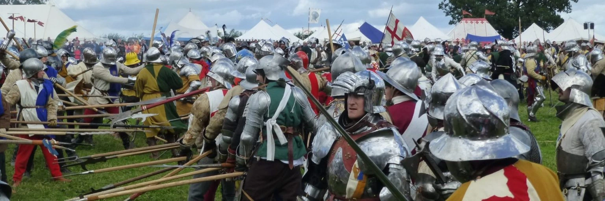
*Colour inspiration: derived from historical livery and materials associated with the period of Sir John Donne.*
</details><br>


A visual colour palette was created using [Coolors](https://coolors.co/) to present and refine the selected hex colour scheme.
<details> <summary><strong> </strong> Original colour pallet (Click to open)</summary>

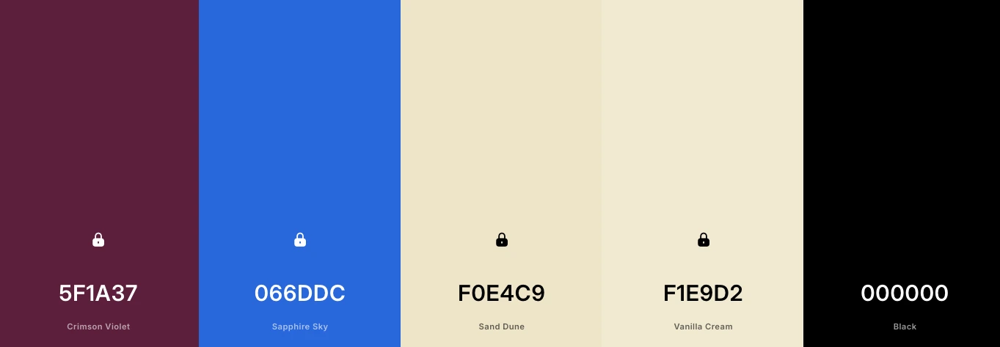
*Original colour pallet: Colour palette generated using Coolors, based on historically inspired tones.*
</details><br>


The visual colour palette was created later updated as noted above.
<details> <summary><strong> </strong> Updated colour pallet (Click to open)</summary>

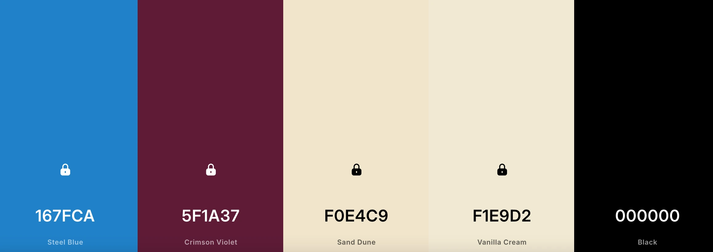
*Updated pallet: Colour palette generated using Coolors, based on historically inspired tones.*
</details><br>

### Typography

#### Heading Font – Macondo  
The heading font used is *Macondo*, applied to all heading elements (H1–H4). This decorative serif-style font was selected to reflect the historical and medieval theme of the website. Its distinctive style helps headings stand out clearly from body text, improving visual hierarchy and reinforcing the overall aesthetic.
<details><summary><strong>Example of the Macondo font (Click to expand)</strong></summary>

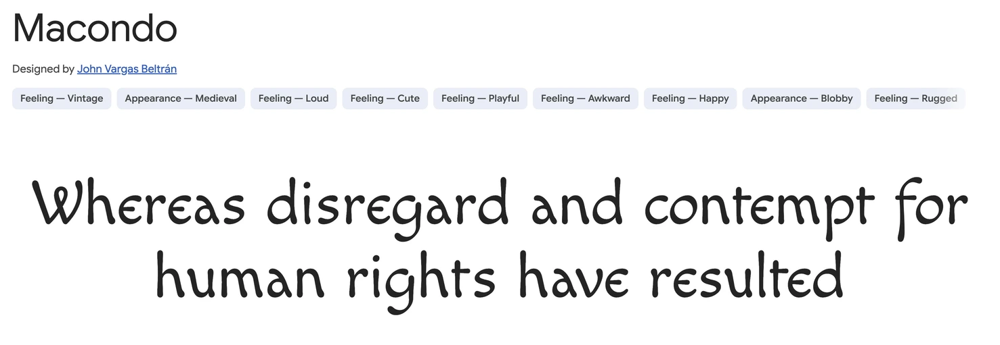  
*Example of the Macondo font, sourced from [Google Fonts](https://fonts.google.com/)*
</details><br>

#### Body Font – DM Sans  
The primary body font is DM Sans, used for paragraphs and general content. This font is clean, modern, and highly legible, making it suitable for longer blocks of text and smaller screen sizes. Its simplicity ensures readability across different devices, supporting accessibility. DM Sans was prioritised for body text due to its high legibility, while Raleway provides a stylistic alternative without compromising readability.
<details><summary><strong>Example of the DM Sans font (Click to expand)</strong></summary>

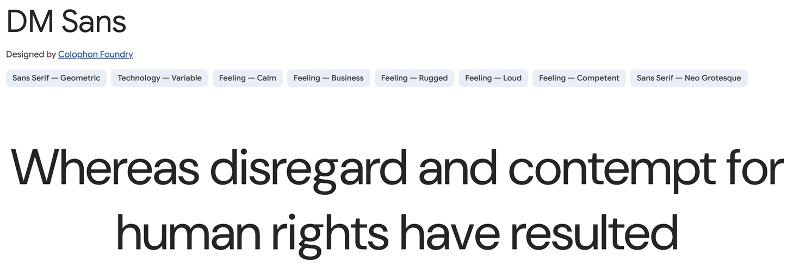  
*Example of the DM Sans font, sourced from [Google Fonts](https://fonts.google.com/)*
</details><br>

#### Supporting Font – Raleway  
*Raleway* is used as a fallback and general site font (applied to the body). It provides a balance between modern design and readability, ensuring consistent presentation if other fonts fail to load.
<details><summary><strong>Example of the Raleway font (Click to expand)</strong></summary>

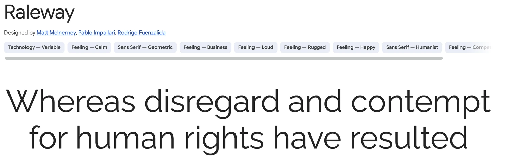  
*Example of the Raleway font, sourced from [Google Fonts](https://fonts.google.com/).*
</details><br>

#### Typography Rationale  
The typography was chosen to create a clear distinction between decorative and functional text. The combination of a stylised heading font (*Macondo*) and a clean sans-serif body font (*DM Sans*) ensures both visual interest and readability.  

This pairing supports accessibility by maintaining legible text for users while also reinforcing the historical theme of the website. The use of web-safe fallback fonts ensures consistent rendering across different browsers and devices.

### Accessibility

The website was designed with accessibility in mind, ensuring that all users, including those with visual or motor impairments, can navigate and interact with the content effectively. Key accessibility features include:

- **Clear contrast between text and background** – All text is displayed with sufficient contrast against its background, supporting readability for users with visual impairments.  
- **Semantic HTML structure** – Proper use of headings, lists, and landmarks ensures that assistive technologies, such as screen readers, can interpret the content correctly.  
- **Alt text for images** – All meaningful images include descriptive alt text, allowing users relying on screen readers to understand visual content.  
- **Responsive layout** – The website is fully responsive, providing a consistent experience across devices and supporting assistive technologies such as zoom, high-contrast modes, and mobile navigation aids.  

### Skeleton Layout / Wireframes

**Purpose:**  
These wireframes outline the structural layout of the website prior to visual styling. They were used to plan the placement of key elements, establish user flow, and ensure a responsive, user-friendly experience across different devices.

### Key Features of the Wireframes

- **Header / Navigation:**  
  Positioned consistently at the top of each page to provide clear and accessible navigation. Designed with simplicity in mind to ensure ease of use on both desktop and mobile devices.

- **Hero / Landing Section:**  
  A prominent introductory area on the homepage, intended to immediately communicate the purpose of the site and engage users visually.

- **Content Sections:**  
  Clearly defined areas for core content, including:
  - Gallery (visual showcase)
  - Events (informational listings)
  - Contact (user interaction and enquiries)

- **Footer:**  
  Contains secondary navigation links and essential information, ensuring accessibility to key pages from anywhere on the site.
  
- **Notes:**

  - The layout prioritises clarity and logical content flow.
  - A mobile-first approach was considered during planning to support responsiveness.  
  - Consistent structure across all pages improves usability and user familiarity.  
  - The 404 page was included to maintain user experience in the event of navigation errors.

<details>
<summary><strong>Skeleton Layout / Wireframe Images</strong> (Click to open)</summary>

**Skeleton Home Page**  
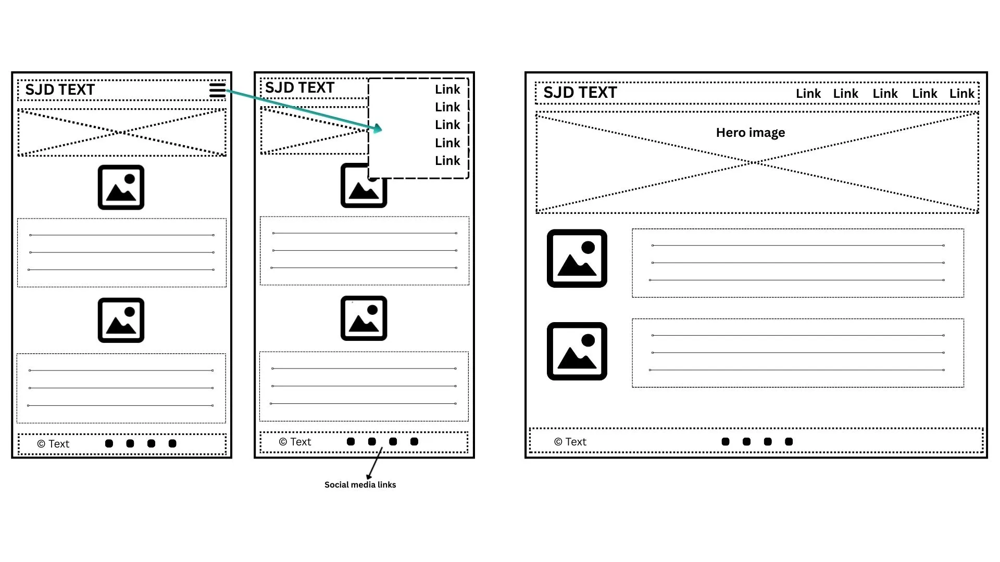

**Skeleton Gallery Page**  
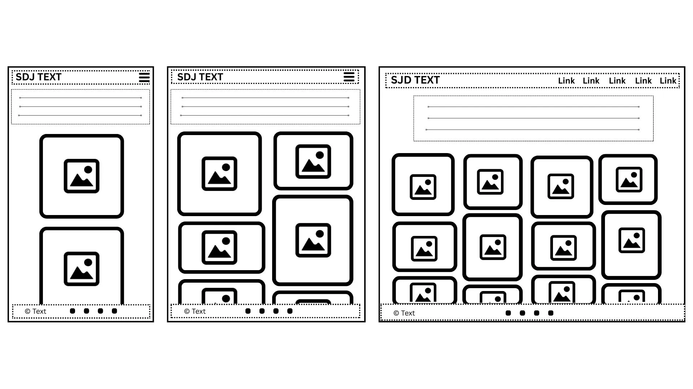

**Skeleton Events Page**  
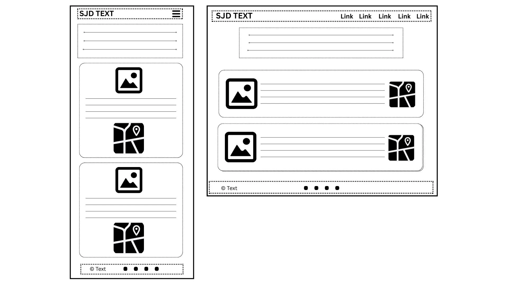

**Skeleton Contact Page**  
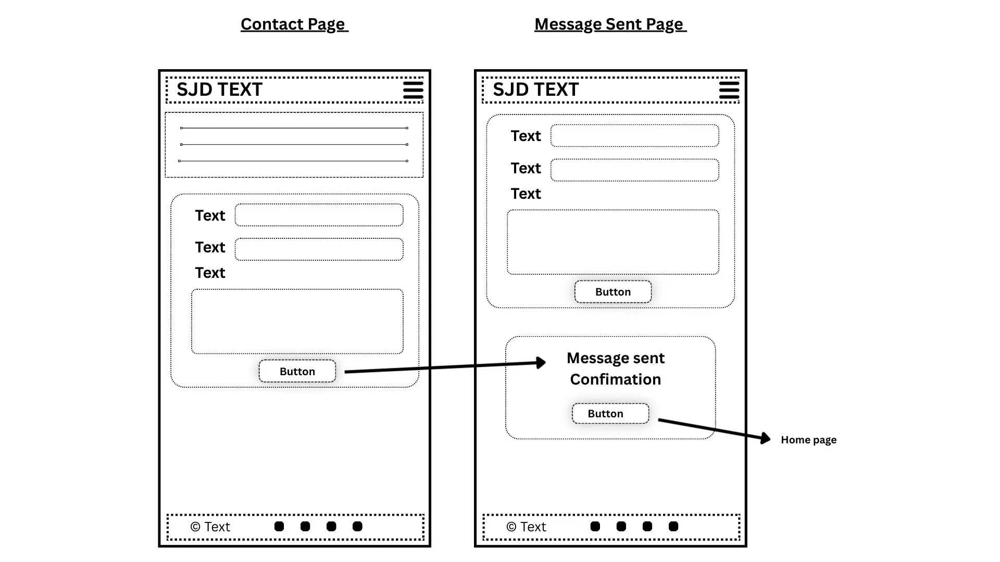

**Skeleton 404 Page**  
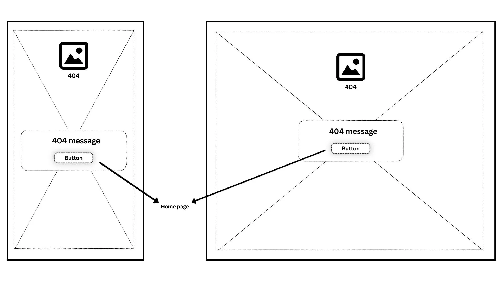

</details>

## Features

<!-- TODO: Add responsive mockup image -->
The website currently includes the following pages:

**Main Navigation Pages**
- Home
- Gallery
- Events
- Contact

**Utility / Support Pages**
- Message Sent
- 404 Error Page

### Navigation Bar

<details> <summary><strong>Navigation Bar</strong> (Click to open)</summary>

Description:

Appears on all pages.

Provides easy navigation between main sections: Home, Gallery, Events, Contact.

Responsive with hamburger menu on small screens.

User Benefit: Users can move between pages without using browser back button. Improves usability on desktop and mobile devices.

</details> <br>

<!-- TODO: Describe the feature and its value to users -->
- Appears on all pages
- Allows easy navigation between sections of the website easily

The navigation bar allows users to easily move between the main sections of the website.

This feature enables visitors to navigate between pages without needing to return to the previous page using the browser back button. It improves usability across desktop and mobile devices.

<!-- TODO: Describe the feature and its value to users -->
feedback ugested an image (favison) was already a symbol on use and could me adaped to be utalised for this fuction.


### Footer

Footer
<details> <summary><strong>Footer</strong> (Click to open)</summary>

Description:

Present on all pages except 404 page.

Contains navigation links, contact info, and related resources.
M. Bass currently does not use any social media, therefore I have included examples of the most popular ones which link to the respective main site webpage. 

User Benefit: Ensures users can always access key info regardless of scroll position.

</details> <br>

<!-- TODO: Add responsive mockup image -->
The footer provides additional navigation options and may include links to related resources or contact information.

This helps users easily locate important information regardless of where they are on the page.
All pages include the footer, with the exception of the 404 page.

The footer provides:

- Additional navigation
- Contact information
- Links to related resources

### Landing / Home Page

Landing / Home Page
<details> <summary><strong>Landing Page / Home</strong> (Click to open)</summary>

Features:

Hero image with introductory text

Visual introduction to the Re-enactment project

Explains historical context and items in the living-history tent

</details> <br>

<!-- TODO: Describe the landing page feature -->
- Large hero image with introductory text
- Introduces the purpose of the website
- Provides a clear entry point for visitors

The landing page introduces users to the Sir John Donne Re-enactment project.

It provides a clear visual introduction to the theme of the website and encourages users to explore further sections.

The main content sections explain the historical context of the Re-enactment and the items displayed within the tent.

These sections help visitors understand the educational purpose of the display and provide further historical insight.


Landing Page

- Hero image with introductory text
- Introduces the Re-enactment project
- Encourages visitors to explore the site

### Gallery / Supporting Images

Gallery / Supporting Images
<details> <summary><strong>Gallery Page</strong> (Click to open)</summary>

Features:

Displays supporting images related to the Re-enactment and historical items.

Helps visitors visually identify items and understand context.

</details> <br>

<!-- TODO: Describe your gallery or content display -->
- Displays supporting images related to the Re-enactment display and historical items.


### Events List page

Events Page
<details> <summary><strong>Events Page</strong> (Click to open)</summary>

Features:

Lists upcoming Re-enactment events, including location, date, and brief description.

Helps users discover opportunities to experience the display in person.


Links are intended to direct users to the relevant live event pages for each location, such as the [Barnet Medieval Festival](https://barnetmedievalfestival.wordpress.com/). In cases where a specific event page is not available, such as [Nottingham Castle](https://www.nottinghamcastle.org.uk/whats-on/), users are instead directed to the venue’s main “What’s On” or landing page.

</details> <br>

<!-- TODO: Describe the Events Page -->
The Events page provides information about upcoming historical re-enactment events where the Sir John Donne living-history display may appear.

Visitors can view event locations, dates, and brief descriptions of the activities taking place. This allows users to discover opportunities to experience the re-enactment display in person.

### Contact page

Contact Page
<details> <summary><strong>Contact Page</strong> (Click to open)</summary>

Features:

Users can submit messages via a sign-up/contact form.

Redirects to a confirmation page (Message Sent) after submission.

</details> <br>

<!-- TODO: Describe the form functionality -->
- Allows users to register or submit information

Allows visitors to send enquiries about the Re-enactment project.

After submission, users are redirected to a confirmation page indicating that their message has been received.


### Message Sent Page

**Description:**  

The *Message Sent* page appears after the Contact form is completed and the *Send* button is pressed. As this is a front-end-only project, the page simulates a successful email confirmation rather than submitting data to a backend service.

It provides clear visual feedback to the user that their message has been received, mimicking the behaviour of a fully functional contact form.

To maintain consistent navigation and reinforce user context, the Contact link remains active in the navigation bar:

```html
<li><a href="contact.html" class="active"><span>Contact</span></a></li>
```

<details> <summary><strong>Message Sent Page Image</strong> (Click to open)</summary>
<!-- TODO:PCTURE HERE -->
</details> <br>

I initially implemented [Web2phone.co.uk](https://web2phone.co.uk/) to allow email and WhatsApp messages to be sent and received without backend functionality; although it worked, the solution relied entirely on external code, which could not be styled to match the rest of the site.  

As a result, I removed it in favour of the *Message Sent* page, which I coded myself. While this page is not functional, it simulates the behaviour of a successful form submission and demonstrates how a working contact form would behave. In the future, I can either implement a functional backend to make the contact form fully active or reintroduce Web2phone while adapting the styling to fit the site’s design.

## 404 Error Page

404 Error Page
<details> <summary><strong>404 Error Page</strong> (Click to open)</summary>

Description:

Displayed when a user visits a page that does not exist.

Provides clear navigation back to Home page.

</details> <br>

The 404 page appears when a user attempts to access a page that does not exist on the website.

The page informs the user that the requested page could not be found and provides a clear navigation option to return to the Home page.

This helps prevent users from becoming lost on the site and improves the overall user experience by guiding them back to a valid page.

### Features Left to Implement

<!-- TODO: List future pplanned features -->
Planned improvements for future versions of the site include:

- Historic Timeline / Timeline of Sir John Donne’s life.

The timeline feature was explored during development but would require more complex interactive functionality. Since it involves multiple events across different time periods, it would be better implemented in a future version using JavaScript or Python. as well as. additional detailed pages about Sir John Donne's Life

- FAQ section to answer common visitor questions.

- 360° tour photo / images in the tent.
Interactive 360° view inside the Re-enactment tent allowing users to explore the medievial tent and click objects and learn more about them.

External Feature Ideas:
- QR codes displayed at the Re-enactment site that link directly to relevant sections of the website

[Back to top](#sir-john-donne-re-enactment)

---

## Technologies Used

### Languages

Languages used:

- HTML5  
- CSS3  

This project was built exclusively using HTML and CSS. No external libraries, frameworks (such as Bootstrap), or JavaScript were used.

### Tools

<!-- TODO: List tools and frameworks -->
The following table lists the key tools, resources, and references used during the development of this website.

| Resource | Purpose / How It Was Used |
|----------|---------------------------|
| [GitHub](https://github.com/) | Used for hosting and managing code repositories, version control, and collaboration |
| [Google Fonts](https://fonts.google.com/) | Used to import the website’s typography, including DM Sans, Macondo, and Raleway fonts via CSS @import for headings, body text, and stylistic elements |
| [Coolors](https://coolors.co/) | Coolors was used to develop and refine a visual colour palette, helping to establish the final hex colour scheme alongside M Bass. |
| [Real Favicongenerator Generator](https://realfavicongenerator.net/your-favicon-is-ready) | Used to create website favicons, including .png, .ico, .svg, and Apple touch icons for browser tabs, bookmarks, and mobile home screens |
| [Font Awesome](https://fontawesome.com/) | Used to source icons and interface elements throughout the website |
| [Gradient Page](https://gradient.page/ui-gradients/instagram) | Used as a visual reference for implementing Instagram gradient styling |
| [OpenReplay](https://openreplay.com/tools/rgba-to-hex/) | Used to convert RGBA 'color' values to hexadecimal format |
| [Free Convert](https://www.freeconvert.com/jpg-to-webp/download) | Used to convert .JPG images to WebP format |
| [To WebP](https://towebp.io) | Used to bulk convert .JPG images to WebP |
| [Squoosh](https://squoosh.app/) | Used to compress image sizes without losing quality |
| [VS Code](https://code.visualstudio.com) | Used as the main code editor for developing the website |
| [Obsidian](https://obsidian.md) | Used for Markdown planning, note-taking, and documentation |
| [MDN](https://developer.mozilla.org/) | Used for HTML & CSS referencing and syntax documentation |
| [Google Maps](https://www.google.com/maps/) | Used to generate embed iframe code for an interactive map, allowing visitors to view the location directly on the website  |
| [Yujin Yeoh](https://yujinyeoh.com/website-mockup-generator?laptop=on&tablet=on&mobile=on&desktop=on&width=1024&preset=preset1&urlScreenshot=https%3A%2F%2Fdavid-cb-uk.github.io%2Fsir-john-donne-reenactment%2Fgallery.html) | Used to create responsive mockup images of my site on different devices | 
| [Chat GPT](https://chatgpt.com/)| Used to generate 404 image based on a custom prompt |
| [Am I Responsive](TBC)   |     | 
| [Lighthouse](TBC)   |     | 
| [WAVE](https://wave.webaim.org)| WAVE ( Web Accessibility Evaluation Tools) help to make web content more accessible to individuals with disabilities.|
| [TBC](TBC)   |     | 


## Project Structure

<!-- TODO: Add responsive mockup image -->

```text
project-root
│
├── index.html
├── gallery.html
├── signup.html
│
├── assets
│   ├── css
│   │   └── style.css
│   │
│   └── images
│       ├── site-images
│       └── readme
│
└── README.md
```

[Back to top](#sir-john-donne-re-enactment)

---

## Testing

<!-- TODO: Explain your testing strategy -->
The website was tested across multiple screen sizes including:

- Desktop
- Tablet
- Mobile
The website was tested to ensure all features function correctly.

### Responsive Design

The layout uses responsive design principles to ensure the site functions effectively across mobile, tablet, and desktop devices.

<!-- TODO: Explain your testing strategy -->
Desktop view:

<!-- TODO: Explain your testing strategy -->
Mobile view:


### Manual Testing

<!-- TODO: Add responsive mockup image -->
- separate .md file??
<!-- TODO: Add responsive mockup image -->
- Navigation links
- Form submission
- Responsive layout on different screen sizes
- The website layout adapts to different screen sizes including mobile devices.

| Feature | Action | Expected Result | Result |
| --- | --- | --- | --- |
| Navigation | Click each link | Correct page loads | P?ass |
| Contact Form | Submit form | Redirect to thank you page | Pa?ss |
| Gallery | View images | Images load correctly | Pa?ss |
| Responsive layout | Resize browser | Layout adapts correctly | P??ass |

### Cross-Browser Testing

<!-- TODO: Add responsive mockup image -->
- Chrome
- Edge
- Safari

<!-- TODO: Add responsive mockup image -->

| Feature | Action | Expected Result | Result |
| --- | --- | --- | --- |
| Chrome | ?? | Correct page loads? | P/F?? |
| Edge | ?? | ?? | P/F?? |
| Safari | ?? | ?? | P/F?? |

### Validator Testing

#### HTML

<!-- TODO  -->
- No errors found using [W3C HTML Validator](https://validator.w3.org/)

#### CSS

<!-- TODO  -->
- No errors found using [W3C CSS Validator](https://jigsaw.w3.org/css-validator/)

### Lighthouse Testing

<!-- TODO  -->

### WAVE - Web Accessibility Evaluation Tools

Home Page
<details> <summary><strong> </strong> WAVE - Home Page (Click to open)</summary>

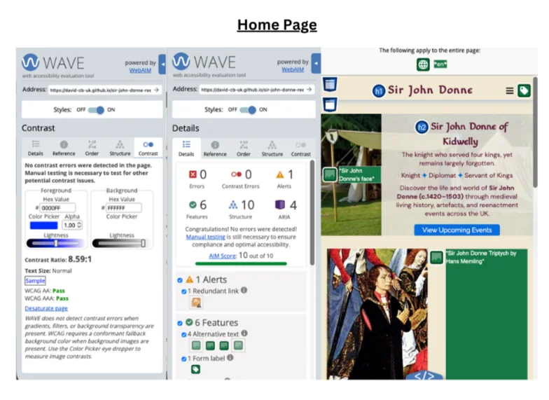
</details><br>

Gallery Page
<details> <summary><strong> </strong> WAVE - Gallery Page (Click to open)</summary>

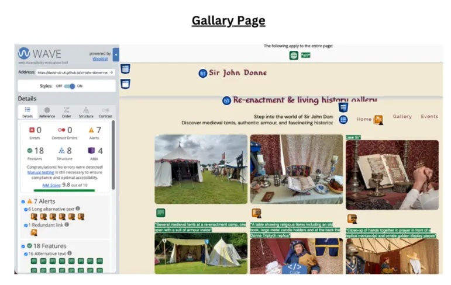</details><br>

Events PAge
<details> <summary><strong> </strong> WAVE - Events Page (Click to open)</summary>

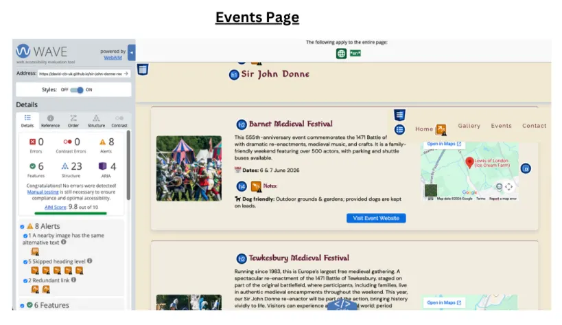
</details><br>

Contact Page
<details> <summary><strong> </strong> WAVE - Contact Page (Click to open)</summary>

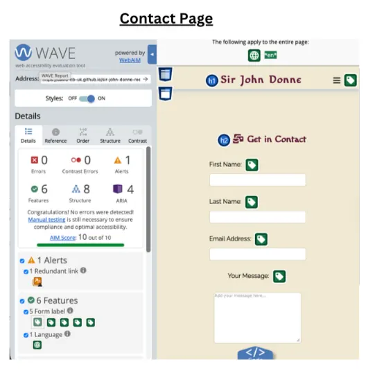
</details><br>

<!-- To add -->
CONTACT PAGE 2???

404 Page ????


### Unfixed Bugs

<!-- TODO  -->
- Minor layout shifts on very small screens???

[Back to top](#sir-john-donne-re-enactment)

---

## Deployment

<!-- TODO Explain how your site is deployed -->
The project was deployed using **GitHub Pages**.

Steps:

1. Navigate to the repository on GitHub
2. Click **Settings**
3. Navigate to **Pages**
4. Select the **main branch**
5. Save changes

The site will become available after a few minutes.

Live site link:  
<https://david-cb-uk.github.io/sir-john-donne-reenactment/>

[Back to top](#sir-john-donne-re-enactment)

---

## Credits

<!-- TODO: Add your content sources -->

- [Code Institute](https://codeinstitute.net/)  
  Course learning materials and walkthrough lessons were used as guidance during the development of this project.

- [Mimo](https://mimo.org/)
  An online learning mobile application that covers programming skills including as HTML, CSS, Flexbox etc.

- [Free Code Camp](https://www.freecodecamp.org/)
  An online learning platform that covers programming skills including as HTML, CSS, Flexbox etc.

- Community support  
  Community forums and discussions were referenced when resolving development issues.

- Duckett, J. (2011) *HTML and CSS: Design and Build Websites*. Indianapolis: John Wiley & Sons.  
  Used as a general reference for HTML and CSS concepts when structuring and styling the website.

-

### Content

<!-- TODO: Add your content sources -->           <!-- TODO: Move these to tools use? -->

- [Code Drip](https://www.youtube.com/watch?v=LHyU-V2U2cI&utm_source=chatgpt.com) 
  Youtube tutorial to create Pinterest‑Like Layout with CSS‑only, without JavaScript.

### Media

<!-- TODO: Add your media sources -->
Images used in this project were sourced from:

- Re-enactor Mike Bass's own photographs
  - Historical references ???? TBC 
  - Many of the orignal historical items and images featured are over 500 years old and are not subject to copyright restrictions.  Acknowledgement and thanks are extended to the custodians of the respective museums and galleries..
  - As a member of The Knights Of Skirbeck, Wars of the Roses Federation & A Taste Of Loyalty production team, M. Bass has access to / and allowed to us thier ofdicia imageary as part of the shered and joint ventures. 
- Photographs of the event locations are taken from the venues’ official promotional materials.

- [404 Image](assets/images/404.webp) generated using [ChatGPT](https://chatgpt.com/) by OpenAI (2026) based on a custom prompt.

[Back to top](#sir-john-donne-re-enactment)

