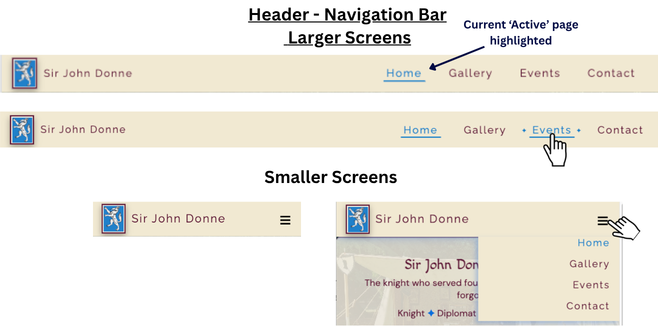
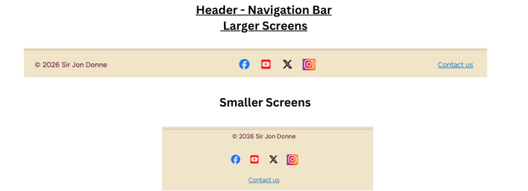
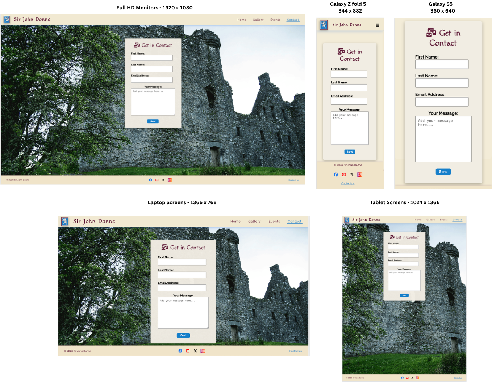
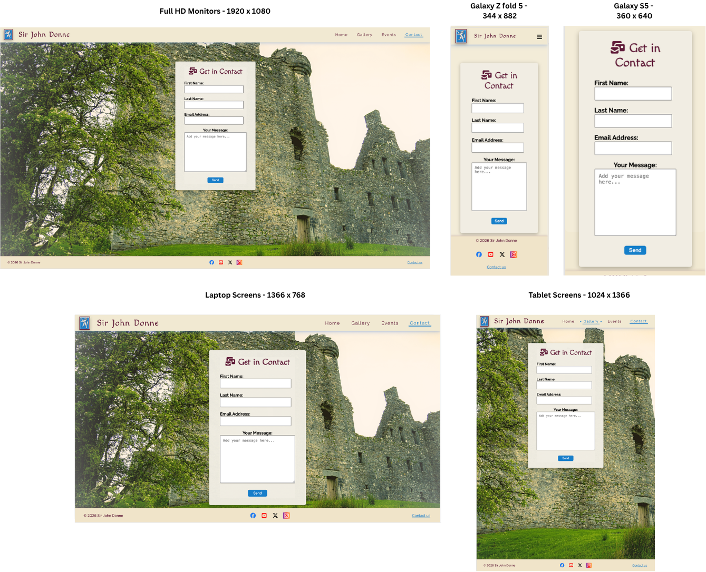
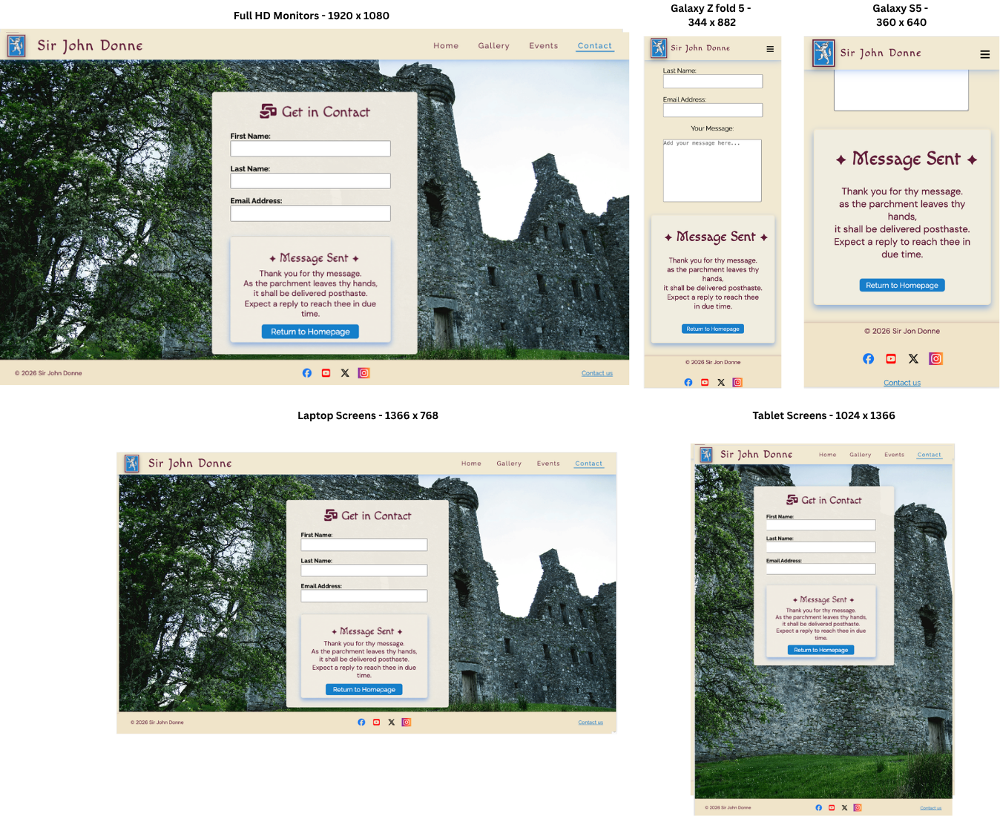
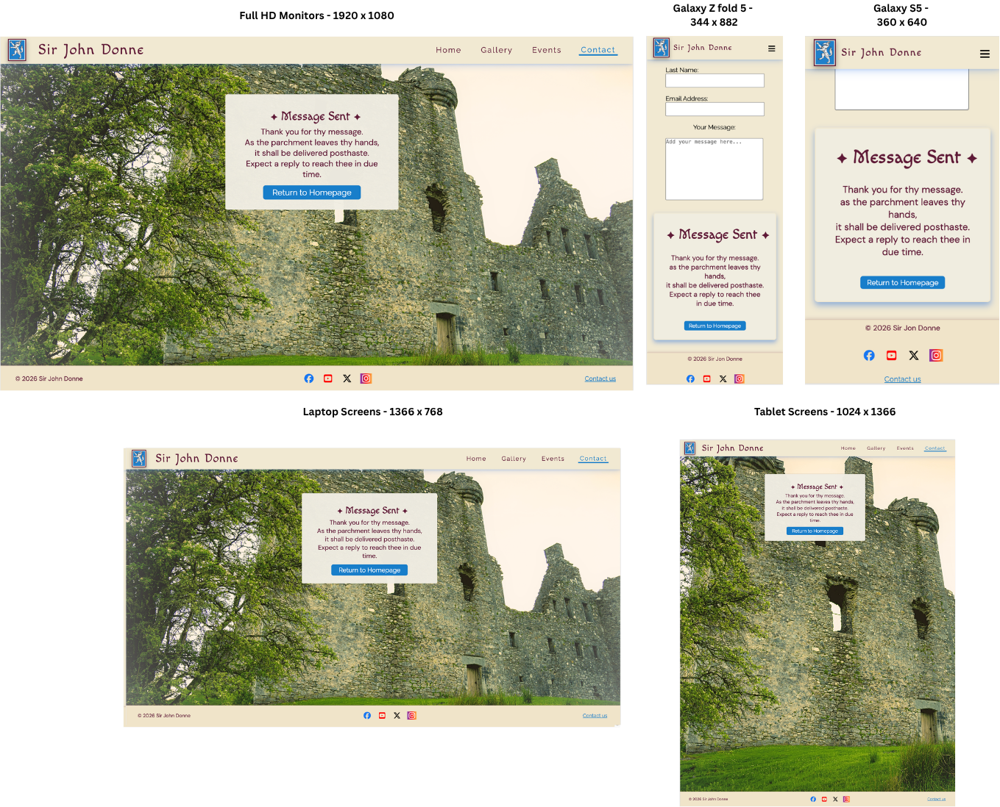
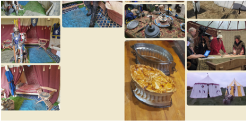

# Sir John Donne re-enactment

[Live Site](https://david-cb-uk.github.io/sir-john-donne-reenactment/) | [Repository](https://github.com/David-CB-UK/sir-john-donne-reenactment)

  

<details><summary> View Responsive Homepage Mockup (Click to expand)</summary>

  
*Showing the landing / home page*
</details>

---

## Table of Contents

1. [Project Overview](#project-overview)
2. [User Experience](#user-experience)
   - [User Stories](#user-stories-and-related-goals)
   - [UX Goals](#user-experience-goals)
3. [Design](#design)
   - [Colour Scheme](#the-colour-scheme)
   - [Typography](#typography)
   - [Accessibility](#accessibility)
   - [Skeleton Layout / Wireframe Images](#skeleton-layout--wireframe-images)
4. [Features](#features)
   - [Navigation Bar](#navigation-bar)
   - [Landing / Home Page](#landing--home-page)
   - [Gallery Page](#gallery-page)
   - [Events Page](#events-page)
   - [Contact Page](#contact-page)
   - [Message Sent Page ](#message-sent-page)
   - [404 Page](#404-error-page)
   - [Footer](#footer)
   - [Favicon & App Icons](#favicon--app-icons)
     - [Classic Favicon ](#classic-favicon)
     - [Google Search Results](#google-search-results)
     - [Android Icons](#android-icons)
     - [Apple Touch Icons](#apple-touch-icons)
5. [User Goals Mapping](#user-goals-mapping)
6. [Technologies Used](#technologies-used)
7. [Project Structure](#project-structure)
8. [Testing](#testing)
   - [Manual / Functional Testing Table](#manual-testing-table)
   - [Cross-Browser Testing](#cross-browser-testing)
   - [Validator Testing](#validator-testing)
   - [WAVE - Web Accessibility Evaluation Tools](#wave---web-accessibility-evaluation-tools)
9. [Deployment](#deployment)
10. [Credits](#credits)
11. [Reflections](#reflections)

---

## Project Overview

The Sir John Donne re-enactment website is designed to support historical education and public engagement through the recreation of a 15th-century living history display. 
The site provides visitors with information about Sir John Donne, the historical context of the re-enactment, and details about the objects and displays used within the re-enactment or living-history tent.

The website is aimed at visitors attending re-enactment events, students interested in medieval history, and members of the public who want to learn more about Sir John Donne and historical re-enactment.

The site helps users quickly find relevant information about the re-enactment, understand the historical context of the displays, and discover how to engage further with the project.

Users interact with the website by navigating through clearly organised sections that explain the re-enactment setup, provide historical background, and offer additional information about the items displayed within the living-history tent.

The goal of the project is to create a **simple, accessible**, and **responsive** website that works across desktop, tablet, and mobile devices.

[Back to top](#sir-john-donne-re-enactment) 

---

## User Stories and Related Goals

The following user stories describe the main users of the Sir John Donne re-enactment website. Each story focuses on user needs, the context of use, and conceptual goals. Implementation details and feature benefits are explored later in the User Goals Mapping and Benefits Table.

### Story 1: Site Owner – M. Bass

As the site owner, M. Bass needs a website that presents the re-enactment professionally, accurately, and engagingly. He requires a platform where both first-time and returning visitors can easily access historical content, visual materials, and information about re-enactment events. The website must also be maintainable and flexible for future updates.

**Goals:**  
- Provide a clear presentation of historical content.  
- Ensure responsive design for desktop, tablet, and mobile devices.  
- Implement intuitive navigation and consistent styling.  
- Allow room for future enhancements, such as interactive timelines, galleries, and messaging systems, to improve visitor engagement and educational value.

### Story 2: Visitors – First-Time

First-time visitors come to the site seeking to understand the purpose of the Sir John Donne re-enactment, who it is for, and how to explore it. Their primary need is clarity and easy orientation.

**Goals:**  
- Immediately understand the site’s purpose and historical context.  
- Access key information efficiently through clear headings, summaries, and visual cues.  
- Navigate seamlessly between pages without confusion.  
- Build trust in the accuracy and credibility of content.  
- Engage visually with historical items, supporting learning and exploration.  
- Use the site comfortably across devices and accessibility needs.

### Story 3: Visitors – Returning

Returning visitors want fast access to updated information, galleries, events, and other specific content. They are familiar with the layout and expect consistent, predictable navigation.

**Goals:**  
- Quickly locate new or updated content, including upcoming events.  
- Access previously viewed information without repetitive navigation.  
- Engage with refreshed gallery items and re-visit historical content.  
- Benefit from reliable, consistent layout and functionality across devices.

### Story 4: Visitors with Accessibility Needs

Visitors with visual, motor, or cognitive impairments require an inclusive website that works with assistive technologies. They need clear structure, readable content, and keyboard-friendly navigation.

**Goals:**  
- Ensure semantic HTML structure and meaningful headings for screen readers.  
- Use alt text for images and sufficient contrast for readability.  
- Avoid complex interactions that could impede accessibility.  
- Provide a responsive and inclusive experience that works across devices and input methods.  
- Plan future enhancements to include accessible interactive content.

> *Note:* User Experience goals (see next section) are derived from these user stories.

## User Experience Goals

### Target Audience

- Visitors attending historical re-enactment events.
- Students and educators interested in early modern history.
- Members of the public interested in historical interpretation.

### First Time Visitor Goals

- Understand the purpose of the site immediately.
- Quickly identify who the site is for.
- Navigate easily between pages.
- Access important information quickly.
- Be able to scan content easily through clear layout and headings.
- Learn about Sir John Donne.
- Understand the historical items displayed in the re-enactment tent.
- Engage with visual content to support learning.
- Trust the accuracy and credibility of the information presented.
- Identify clear next steps (e.g. attending events or making contact).
- Access content easily across different devices and abilities.
- Feel confident that the information is accurate and trustworthy.
- Understand the historical items displayed in the re-enactment tent.
- Discover further resources about re-enactment and historical interpretation.

### Returning Visitor Goals

- Find new or updated information.
- Navigate directly to sections of interest.
- Find out about future events.
- Revisit specific content quickly (e.g. gallery or events).
- Know how to contact site owner / historical re-enactment group.

### Site Owner Goals

- Present information clearly.
- Provide a clean and responsive design.
- Ensure accessibility across devices.
- Provide educational material about Sir John Donne.
- Support public engagement at re-enactment events.
- Offer an accessible digital resource that complements the physical re-enactment display.

### Future Features and Goals

Planned features will continue to support user goals:

*Historic Timeline*: Helps first-time and returning visitors quickly understand Sir John Donne’s life and historical context.
*FAQ Section*: Supports first-time visitors by answering common questions efficiently.
*360° Tent Tour*: Enhances engagement and understanding of historical items.
*QR Codes at Events*: Provides seamless access to relevant pages during live re-enactments.

These goals directly informed the design and feature implementation of the website, ensuring a user-centred approach throughout development.

[Back to top](#sir-john-donne-re-enactment)

---

## Design

### The Colour scheme

### Primary Colour – #5F1A37  
The primary colour is a deep burgundy (#5F1A37), used for headings and key interface elements. This colour provides strong contrast against the background, improving readability while also reinforcing the historical theme of the website.

### Secondary Colour – #F1E9D2  
The secondary colour is a parchment-style beige (#F1E9D2), used as the main background colour. This creates a neutral and visually comfortable base, supporting accessibility by reducing eye strain and allowing content to remain clear and legible.

### Accent Colour – #167FCA  
An accent colour of blue (#167FCA) is used for interactive elements such as buttons, navigation highlights, and hover states. This ensures that clickable elements are easily identifiable, improving usability and user experience.
Originally #066DDC was chosen, however when I was given the image that was made into the favicon [Wolf favicon](assets/favicon/web-app-manifest-512x512.png) image it was decided that we would use that 'color' throughout as a more accurate colour.

### Colour Scheme Rationale  
The colour scheme was chosen to create a clear and accessible visual design, with sufficient contrast between foreground and background elements to support readability. The selected colours are inspired by the **livery and clothing worn by medieval soldiers and retainers**, linking the design to the historical context of Sir John Donne and it was important to the site owner that this was reflected.

The burgundy reflects tones commonly found in period garments _(see the colour inspiration  below)_ , while the parchment background evokes materials such as aged paper and cloth.  
<details> <summary><strong> </strong> The colour inspiration (Click to expand)</summary>


Colour inspiration: derived from historical livery and materials associated with the period of Sir John Donne; the colour scheme was chosen in collaboration with the site owner (see [Story 1](#story-1-site-owner-m-bass)) to reflect historically accurate tones while maintaining accessibility.

This supports:
- **Story 1:** authentic historical presentation  
- **Story 2:** clear visual hierarchy for first-time users  
- **Story 4:** sufficient contrast for readability  
</details><br>

A visual colour palette was created using [Coolors](https://coolors.co/) to present and refine the selected hex colour scheme, in collaboration with the site owner.
<details> <summary><strong> </strong> Original colour palette (Click to expand)</summary>


*Original colour palette: Colour palette generated using Coolors, based on historically inspired tones.*
</details><br>


The visual colour palette was later updated as noted above.


*Updated palette: Colour palette generated using Coolors, based on historically inspired tones.*


### Typography

Fonts were selected through a collaborative decision-making process with the site owner (M. Bass) (see [Story 1: Site Owner](#story-1-site-owner-m-bass)), who required the website to reflect a historical, medieval aesthetic while remaining clear, readable, and accessible across all devices.

This decision supports key user needs:
- _Story 1 (Site Owner):_ presenting an authentic and professional historical identity  
- _Story 2 (First-Time Visitors):_ ensuring content is easy to read and understand  
- _Story 4 (Accessibility):_ maintaining readability for users with varying needs and devices  

To achieve this, a range of typefaces were reviewed using Google Fonts. The final selection balances decorative styling for visual impact with highly legible fonts for longer text content, particularly on smaller screens and across different devices.

#### Heading Font – Macondo  
The heading font used is *Macondo*, applied to all heading elements (H1–H4). This decorative serif-style font was selected to reflect the historical and medieval theme of the website. Its distinctive style helps headings stand out clearly from body text, improving visual hierarchy and reinforcing the overall aesthetic.
<details><summary><strong>Example of the Macondo font (Click to expand)</strong></summary>

  
*Example of the Macondo font, sourced from [Google Fonts](https://fonts.google.com/)*
</details><br>

#### Body Font – DM Sans  
The primary body font is DM Sans, used for paragraphs and general content. This font is clean, modern, and highly legible, making it suitable for longer blocks of text and smaller screen sizes. Its simplicity ensures readability across different devices, supporting accessibility. DM Sans was prioritised for body text due to its high legibility, while Raleway provides a stylistic alternative without compromising readability.
<details><summary><strong>Example of the DM Sans font (Click to expand)</strong></summary>

  
*Example of the DM Sans font, sourced from [Google Fonts](https://fonts.google.com/)*
</details><br>

#### Supporting Font – Raleway  
*Raleway* is used as a fallback and general site font (applied to the body). It provides a balance between modern design and readability, ensuring consistent presentation if other fonts fail to load.
<details><summary><strong>Example of the Raleway font (Click to expand)</strong></summary>

  
*Example of the Raleway font, sourced from [Google Fonts](https://fonts.google.com/).*
</details><br>

#### Typography Rationale  
The typography was chosen to create a clear distinction between decorative and functional text. The combination of a stylised heading font (*Macondo*) and a clean sans-serif body font (*DM Sans*) ensures both visual interest and readability.  

This pairing supports accessibility by maintaining legible text for users while also reinforcing the historical theme of the website. The use of web-safe fallback fonts ensures consistent rendering across different browsers and devices.

### Accessibility

The website was designed with accessibility in mind, ensuring that all users, including those with visual or motor impairments, can navigate and interact with the content effectively. Key accessibility features include:

- **Clear contrast between text and background** – All text is displayed with sufficient contrast against its background, supporting readability for users with visual impairments.  
- **Semantic HTML structure** – Proper use of headings, lists, and landmarks ensures that assistive technologies, such as screen readers, can interpret the content correctly.  
- **Alt text for images** – All meaningful images include descriptive alt text, allowing users relying on screen readers to understand visual content.  
- **Responsive layout** – The website is fully responsive, providing a consistent experience across devices and supporting assistive technologies such as zoom, high-contrast modes, and mobile navigation aids.  

### Skeleton Layout / Wireframes

**Purpose:**  
The wireframes were initially created as hand-sketched notes in collaboration with M. Bass and later developed into digital wireframes using [Canva](https://www.canva.com/online-whiteboard/wireframes/). These wireframes outline the structural layout of the website prior to visual styling. They were used to plan the placement of key elements, establish user flow, and ensure a responsive, user-friendly experience across different devices.


<details>
  <summary><mark><strong>Skeleton Layout / Wireframe Images</strong> (Click to expand)</mark></summary>

**Skeleton Home Page**  


**Skeleton Gallery Page**  


**Skeleton Events Page**  


**Skeleton Contact Page**  


**Skeleton 404 Page**  


</details>

### Key Features of the Wireframes

- **Header / Navigation:**  
  Positioned consistently at the top of each page to provide clear and accessible navigation. Designed with simplicity in mind to ensure ease of use on both desktop and mobile devices. The active page is clearly indicated using a blue highlight, with an underline on larger screens, to enhance user awareness.

- **Hero / Landing Section:**  
  A prominent introductory area on the homepage, intended to immediately communicate the purpose of the site and engage users visually.

- **Content Sections:**  
  Clearly defined areas for core content, including:
  - Gallery (visual showcase)
  - Events (informational listings)
  - Contact (user interaction and enquiries)

- **Footer:**  
  Contains secondary navigation links and essential information, ensuring accessibility to key pages from anywhere on the site.
  
- **Notes:**

  - The layout prioritises clarity and logical content flow.
  - A mobile-first approach was considered during planning to support responsiveness.  
  - Consistent structure across all pages improves usability and user familiarity.  
  - The 404 page was included to maintain user experience in the event of navigation errors.

[Back to top](#sir-john-donne-re-enactment)

---

## Features
The features below were implemented to address the UX and design goals described above. The website currently includes the following pages:

**Main Navigation Pages**
- Home
- Gallery
- Events
- Contact

**Utility / Support Pages**
- Message Sent
- 404 Error Page

### Navigation Bar

<details> <summary><strong>Navigation Bar</strong> (Click to expand)</summary>


_The original navigation bar._
</details> <br>

<details> <summary><strong>Updated Navigation Bar</strong> (Click to expand)</summary>


_The updated navigation bar following feedback as noted below._
</details> <br>

The navigation bar appears on all pages, and provides easy navigation between the main sections: Home, Gallery, Events, Contact. There is a responsive hamburger (drop down) menu on small screens.

_Navigation Bar Styling Fix:_
The navigation bar links were carefully styled to maintain consistent colors across Edge, Chrome, and Safari. The active page is now clearly indicated with a distinct blue color and underline on larger screens, improving user awareness of their current location.

While these adjustments ensure a consistent appearance on major browsers, it is possible that some less common browsers, older versions, or mobile browsers may still apply their own default styles, potentially affecting link colors or hover states. Explicit CSS rules were used to minimise this, after safari's browser was taking on the nav bar colour styling, yet slight variations may occur in edge cases due to browser-specific rendering or operating system accessibility settings.

**User Benefit:**  This feature enables visitors to navigate between pages without needing to return to the previous page using the browser back button. It improves usability across desktop and mobile devices.

**Notes / Feedback:** 
- A logo or icon was suggested. The existing [favicon](assets/favicon/web-app-manifest-512x512.png) was already a suitable and readily available symbol, and it was adapted for use in this role.
- Peer feedback highlighted that the current page was not visually distinct in the navigation bar _(See updated version above)_, to address this, active page styling was implemented using a blue colour and underline to clearly indicate the user’s location.
- A minor CSS issue affecting decorative `✦` elements during hover states was identified and resolved during implementation.

### Footer

<details> <summary><strong>Footer</strong> (Click to expand)</summary>


_The original footer._
</details> 
<details> <summary><strong>Updated Navigation Bar</strong> (Click to expand)</summary><br>



_The updated footer following feedback as noted below._
</details> <br>


The footer is present on all pages except the 404 page. The footer contains navigation links, contact info, and related resources; M. Bass currently does not use any social media, therefore I have included examples of the most popular social media links, with each link opening to the respective main site webpage.

Due to varying screen sizes, the footer is not always immediately visible and may require the user to scroll to the bottom of the page to access it.

**User Benefit:** Provides consistent access to key information and navigation across the site, ensuring usability even when content extends beyond the initial viewport.

**Feedback**
- A spelling error in the footer was identified during user feedback testing and has since been corrected, improving accuracy and presentation.

### Favicon & App Icons

The website includes multiple icon formats to ensure a consistent and professional appearance across all platforms, devices, and browsing contexts.

<details> <summary><strong>Classic Favicon</strong> (Click to expand)</summary>
<br>


**Details:**  
- `favicon.ico` supports legacy browsers and Windows shortcuts (16x16, 32x32, 48x48).  
- `favicon-32x32.png` supports modern browsers and standard tabs.

**User Benefit:**  
- Provides clear identification of the site in browser tabs and bookmarks.  
- Improves usability by allowing users to quickly locate the site among multiple open tabs.  
- Ensures compatibility with older and modern browsers.  

</details><br>

<details> <summary><strong>Google Search Results</strong> (Click to expand)</summary>


**Details:**  
- Search results display the favicon next to the page listing.  

**User Benefit:**  
- Increases brand recognition in search results.  
- Enhances credibility and trust, as a branded icon signals a maintained and professional site.  

</details><br>

<details> <summary><strong>Android Icons</strong> (Click to expand)</summary>


**Details:**  
- `android-chrome-192x192.png` – for Android home screen and Progressive Web Apps (PWA).  
- `android-chrome-512x512.png` – for Android splash screen and high-resolution displays.

**User Benefit:**  
- Allows users to add the website as a home screen shortcut for quick access.  
- Supports mobile engagement and PWA functionality.  
- Provides crisp and scalable images on high-density screens.  

</details><br>

<details> <summary><strong>Apple Touch Icons</strong> (Click to expand)</summary>
<br>


**Details:**  
- `apple-touch-icon.png` (180x180) is used for iOS home screens and Safari bookmarks.

**User Benefit:**  
- Users can easily save and access the site from an iPhone or iPad home screen.  
- Ensures the site appears clearly and professionally on iOS devices.  
- Improves mobile UX by providing a visually consistent experience across platforms.  

</details><br>

**UX Rationale:**  
Including multiple icon formats ensures that visitors have a **seamless and recognizable experience** across browsers, devices, and operating systems. It reinforces the site’s professional appearance, promotes brand consistency, and improves discoverability, whether users are browsing, bookmarking, or saving the site to their mobile devices.


### Landing / Home Page

<details> <summary><strong>Home/Landing Page image</strong> (Click to expand)</summary>
<br>


</details> <br>

Features:

- Large hero image with introductory text.
- Visual introduction to the re-enactment project.
- Explains historical context.
- Introduces the purpose of the website; being a re-enactment and living history site.
- Provides a clear entry point for visitors.
- encourages users to explore the site.

The landing page introduces users to the Sir John Donne re-enactment project.
It provides a clear visual introduction to the theme of the website and encourages users to explore further sections.
The main content sections explain the historical context of the re-enactment.

### Gallery Page

<details> <summary><strong>Gallery Page</strong> (Click to expand)</summary>


</details> <br>


**Features:**
- Displays supporting images related to the Sir John Donne re-enactment and historical items.
- Provides clear visual context for objects and displays featured in the living-history tent.
- Supports a structured and consistent layout with headings and captions for each image.
- Fully responsive layout ensures images are accessible on desktop, tablet, and mobile devices.

**User Benefit**: Visitors can visually explore historical items, gaining a better understanding of the re-enactment setup. Images support learning by providing immediate visual references and context for first-time and returning visitors. Gallery layout prioritises clarity and ease of navigation between images

**Notes**:
- Future enhancements could include lightbox functionality for larger image views or interactive descriptions
- Consistency with the site’s typography and colour scheme maintains a cohesive user experience

### Events page

<details><summary><strong>Events Page</strong> (Click to expand)</summary>


</details> <br>

**Features:**
- Lists upcoming historical re-enactment events, including location, date, and brief description.
- Provides links to venue pages or live event information where available.
- Helps users discover opportunities to experience the re-enactment display in person.
- Supports a structured layout for easy scanning of events.
- Fully responsive layout ensures usability on desktop, tablet, and mobile devices.

Links are intended to direct users to the relevant live event pages for each location, such as the [Barnet Medieval Festival](https://barnetmedievalfestival.wordpress.com/). In cases where a specific event page is not available, such as [Nottingham Castle](https://www.nottinghamcastle.org.uk/whats-on/), users are instead directed to the venue’s main “What’s On” or landing page.

**User Benefit**: Visitors can quickly find relevant events, understand where and when the re-enactment will take place, and plan their attendance. This supports both first-time and returning visitors in engaging with the Sir John Donne site.

**Notes / Feedback:**  
- External links open to official venue or event pages for accurate information.
- Consistent design ensures events list is visually aligned with other site pages.  
- Future enhancements could include calendar integration or interactive maps.

### Contact page

<details> <summary><strong>Contact Page</strong> (Click to expand)</summary>


_Original image prior to update_
</details> <br>

<details> <summary><strong>Updated Contact Page</strong> (Click to expand)</summary>


_Image of updated page following feedback_
</details> <br>

<details> <summary><strong>Updated Contact Page Version 3</strong> (Click to expand)</summary>


_Image of updated page following further  reflection and additinal feedback_
</details> <br>

Users can submit messages via a sign-up/contact form; the form needs to be completed and requires an @ symbol for validation in the email address field or it will show an error message as can be seen below.

Based on feedback about excessive empty space around the form, the layout was updated (and the update copied to the message-sent form):

The form was placed inside a container with a subtle background and rounded edges, giving it a more “pop-up” appearance and improving visual structure.

A background image was introduced on larger screens to reduce unused space and enhance overall visual appeal. From a UX perspective, this reduces excessive negative space and creates a more visually balanced and engaging layout for users on wider viewports. The selected image—a ruined castle—reinforces the medieval theme of the site, supporting visual storytelling and ensuring thematic consistency across pages. This directly supports relevant user stories, such as users wanting an immersive and visually engaging experience that reflects the historical theme.

Furthermore, the inclusion of the background image improves visual hierarchy by allowing the form container to stand out more prominently. This establishes a clear focal point, making the form appear more like a modal or pop-up element rather than an isolated component on an otherwise empty page. As a result, user attention is more effectively directed towards the primary interactive element, supporting user stories focused on ease of interaction and clarity when completing tasks such as submitting a contact form.
Upon evaluation, the original image appeared overly harsh and visually dominant, which risked distracting from key content and reducing readability. To address this, the image was refined using [Canva](https://www.canva.com/online-whiteboard/wireframes/), with adjustments made to colour balance, contrast, saturation, sharpness, and temperature. These changes softened the visual impact, reduced potential visual strain, and improved accessibility by maintaining sufficient contrast between foreground content and background elements. This aligns with user needs for readable, comfortable interfaces that do not hinder task completion.

On smaller screens, the background image was removed to prevent content overflow and maintain readability, ensuring the focus remains on the form. This responsive adjustment further supports usability by prioritising clarity and efficient interaction on mobile devices.

Overall, these refinements ensure stronger visual consistency with the established colour palette and styling of the navigation, footer, and other pages, contributing to a cohesive, accessible, and user-centred design that clearly reflects and supports the defined user stories.

<details> <summary><strong>Error Message</strong> (Click to expand)</summary>

  
</details><br>

**Features:**
- Allows visitors to submit messages via a contact form.
- After submission, users are redirected to a *Message Sent* confirmation page indicating that their message has been received.
- Structured form layout with clear input fields and labels.
- Fully responsive design ensures accessibility on desktop, tablet, and mobile devices.

**User Benefit**: Visitors can easily submit enquiries or questions about the re-enactment project, ensuring smooth communication with the site owner.

**Notes / Feedback:**  
- The contact form currently simulates submissions (front-end only).
- Future improvements could include backend integration or styled email notifications.  
- Consistent typography and colour scheme aligns with overall site design.
- The contact page has a lot of unused whitespace on screens larger than mobile devices.
- The page has significant whitespace on larger screens; the background image helps fill this without overwhelming the form.
- Implementing a pop-up window that appears when the "Contact Us" button is clicked would provide a more compact and interactive design, but this requires JavaScript, which I have not learnt yet.

### Message Sent Page

<details> <summary><strong>Message Sent Page</strong> (Click to expand)</summary>


_Original image prior to update_
</details> <br>

<details> <summary><strong>Updated Message Sent Page</strong> (Click to expand)</summary>


_Image of updated page following feedback_
</details> <br>

<details> <summary><strong>Updated Message Sent Page version 3</strong> (Click to expand)</summary>


_Image of updated page following changes to contact form and prevent scrolling on larger screens_
</details> <br>

**Description:**  

The *Message Sent* page appears after the Contact form is completed and the *Send* button is pressed. As this is a front-end-only project, the page simulates a successful email confirmation rather than submitting data to a backend service.

It provides clear visual feedback to the user that their message has been received, mimicking the behaviour of a fully functional contact form.

To maintain consistent navigation and reinforce user context, the Contact link remains active in the navigation bar:

```html
<li><a href="contact.html" class="active"><span>Contact</span></a></li>
```

I initially implemented [Web2phone](https://web2phone.co.uk/) to allow email and WhatsApp messages to be sent and received without backend functionality; although this was functional, the solution relied entirely on external code, which could not be styled to match the rest of the site.  

As a result, I removed it in favour of the *Message Sent* page, which I coded myself. While this page is not functional, it simulates the behaviour of a successful form submission and demonstrates how a working contact form would behave. In the future, I can either implement a functional backend to make the contact form fully active or reintroduce Web2phone while adapting the styling to fit the site’s design.


**User Benefit**: The Immediate visual feedback on form submission builds confidence that messages are received successfully.

## 404 Error Page

<details> <summary><strong>404 Error Page</strong> (Click to expand)</summary>


</details> <br>

A custom 404 page was implemented to handle invalid or non-existent URLs. 
It provides users with clear feedback, possible reasons for the error, and navigation options to return to key areas of the site.

Due to GitHub Pages being a static hosting platform, server-side handling of malformed or restricted paths is not configurable. However, the 404 page ensures a consistent and user-friendly recovery experience.

**Features**:

- The 404 page appears when a user attempts to access a page that does not exist on the website;  clearly informing the user that the page they requested does not exist.
- The page informs the user that the requested page could not be found and provides clear navigation (through a visible link/button) back to Home page.
- Uses the same header, footer, and site layout as other pages for consistency.
- Responsive design ensures the page works on desktop, tablet, and mobile devices.
- the 404 page maintains the same design elements to reinforce confidence.
- Designed to be _fun and engaging_, giving visitors a little surprise when they encounter it—adds personality to the site and encourages exploration.

**User Benefit**: 
- Helps visitors quickly recover from navigation errors without getting lost.
- Maintains consistent branding and design, reinforcing trust and usability.
- This helps prevent users from becoming lost on the site and improves the overall user experience by guiding them back to a valid page.

**Notes / Feedback**:
- Future enhancement could include a search bar or suggested links to popular pages.
- Currently static; could add an animated element or creative illustration to improve engagement.

### Features Left to Implement

Planned improvements for future versions of the site include:

- Historic Timeline / Timeline of Sir John Donne’s life.
  The timeline feature was explored during development but would require more complex interactive functionality. Since it involves multiple events across different time periods, it would be better implemented in a future version using JavaScript or Python. as well as additional detailed pages about Sir John Donne's Life

- FAQ section to answer common visitor questions.

- 360° tour photo / images in the tent.
Interactive 360° view inside the re-enactment tent allowing users to explore the medieval tent and click objects and learn more about them.

External Feature Ideas:
- QR codes displayed at the re-enactment site that link directly to relevant sections of the website

[Back to top](#sir-john-donne-re-enactment)

---

## User Goals Mapping

The following section maps implemented features to user stories and goals, showing how each design choice supports the needs of first-time visitors, returning visitors, and site owner objectives. Future enhancements are also noted. Each feature links back to the relevant user story: (Story 1: Site Owner, Story 2: First-Time Visitors, Story 3: Returning Visitors, Story 4: Accessibility)

- **Navigation Bar** ([Story 1: Site Owner](#story-1-site-owner-m-bass), [Story 2: First-Time Visitors](#story-2-visitors-first-time), [Story 3: Returning Visitors](#story-3-visitors-returning), [Story 4: Accessibility](#story-4-visitors-with-accessibility-needs))  
  - First-time visitors: easily move between pages and understand the site structure.  
  - Returning visitors: quickly reach familiar sections.  
  - All users: maintain awareness of location within the site.  
  - Accessibility: keyboard navigation and screen reader support.  
  - Site Owner: consistent branding across pages.

- **Landing / Home Page** ([Story 2](#story-2-visitors-first-time), [Story 3](#story-3-visitors-returning))  
  - First-time visitors: understand site purpose and historical context.  
  - All users: structured content builds trust and encourages exploration.  
  - All users: visual hierarchy and prominent content sections support scanning and engagement.

- **Gallery Page** ([Story 2](#story-2-visitors-first-time), [Target Audience](#user-experience))  
  - First-time visitors and target audience: engage visually with historical items.  
  - Returning visitors: explore new or updated images.  
  - All users: future enhancements may include interactive lightbox or descriptive content.  

- **Events Page** ([Story 3](#story-3-visitors-returning), [Story 2](#story-2-visitors-first-time))  
  - Returning visitors: locate upcoming events and external venue information.  
  - First-time visitors: discover opportunities to attend re-enactments.  
  - All users: plan visits efficiently with clear information and actionable next steps.  

- **Contact / Message Sent Page** ([Story 3](#story-3-visitors-returning), [Story 1](#story-1-site-owner-m-bass))  
  - Returning visitors: submit enquiries or connect with site owner.  
  - All users: clear form feedback builds confidence, structured layout ensures easy use.  
  - Future: integrate backend functionality for full messaging.  

- **404 Error Page** ([Story 2](#story-2-visitors-first-time), [Story 3](#story-3-visitors-returning), [Story 1](#story-1-site-owner-m-bass))  
  - All visitors: recover quickly from navigation errors.  
  - Site Owner: maintain branding and engagement even on error pages.  
  - All users: playful/fun design improves user experience while maintaining trust.  

- **Clear Content Structure** ([Story 2](#story-2-visitors-first-time), [Story 4](#story-4-visitors-with-accessibility-needs))  
  - First-time visitors: quickly locate key information.  
  - All users: consistent layout improves comprehension.  

- **Responsive Design** ([Story 1](#story-1-site-owner-m-bass), [Story 2](#story-2-visitors-first-time), [Story 3](#story-3-visitors-returning))  
  - All users: seamless experience across desktop, tablet, and mobile devices.  
  - Site Owner: accessible and professional presentation.  

- **Accessibility Features** ([Story 4](#story-4-visitors-with-accessibility-needs), [Story 1](#story-1-site-owner-m-bass))  
  - All users: inclusive experience for visitors with visual, motor, or cognitive impairments.  
  - Site Owner: meets accessibility standards and legal guidance.  
  - Supports semantic HTML, meaningful headings, alt text for images, sufficient contrast, and keyboard navigation.  

### User Benefit Summary Table
(Story 1: Site Owner, Story 2: First-Time Visitors, Story 3: Returning Visitors, Story 4: Accessibility)

| Page / Feature         | Key Goals Supported                                     | User Benefits                                                                 | Linked User Stories |
|-----------------------|---------------------------------------------------------|-------------------------------------------------------------------------------|------------------|
| Navigation Bar         | First-time & returning visitors, accessibility         | Easy navigation, clear location awareness, keyboard-friendly                 | 1, 2, 3, 4       |
| Landing / Home Page    | First-time visitors, all users                          | Immediate understanding of purpose, visual engagement, trust building, clear hierarchy | 2, 3             |
| Gallery Page           | First-time visitors, target audience                    | Visual exploration of historical items, supports learning, future interactive potential | 2, Target Audience|
| Events Page            | Returning visitors, first-time visitors, all users     | Discover events quickly, plan attendance, access relevant info, take next steps | 2, 3             |
| Contact / Message Sent | Returning visitors, all users                            | Submit enquiries easily, receive immediate feedback, structured and clear form layout, trust in site | 1, 3             |
| 404 Error Page         | First-time & returning visitors, all users, site owner | Recover from errors quickly, engaging and playful experience, maintains branding | 1, 2, 3          |
| Clear Content Structure| First-time & all users                                  | Access information quickly, content is logical, readable, and easy to understand | 2, 4             |
| Responsive Design      | Site owner & all users                                  | Seamless experience on desktop, tablet, mobile devices                        | 1, 2, 3          |
| Accessibility Features | Site owner & all users                                  | Inclusive design, usable by people with visual/motor/cognitive impairments, screen reader friendly | 1, 4             |

<br>

[Back to top](#sir-john-donne-re-enactment)

---

## Technologies Used

### Languages

Languages used:

- HTML5  
- CSS3  

This project was built exclusively using HTML and CSS. No external libraries, frameworks (such as Bootstrap), or JavaScript were used.

### Tools

The following table lists the key tools, resources, and references used during the development of this website.

| Resource | Purpose / How It Was Used |
|----------|---------------------------|
| [GitHub](https://github.com/) | Used for hosting and managing code repositories, version control, and collaboration.|
| [Google Fonts](https://fonts.google.com/) | Used to import the website’s typography, including DM Sans, Macondo, and Raleway fonts via CSS @import for headings, body text, and stylistic elements.|
| [Coolors](https://coolors.co/) | Coolors was used to develop and refine a visual colour palette, helping to establish the final hex colour scheme alongside M Bass. |
|[Canva](https://www.canva.com/online-whiteboard/wireframes/)| These skeleton wireframes were created using Canva, a tool for designing and arranging website layouts quickly and visually. It was also used to change the visual style of the background castle picture |
| [Real Favicongenerator Generator](https://realfavicongenerator.net/your-favicon-is-ready) | Used to create website favicons, including .png, .ico, .svg, and Apple touch icons for browser tabs, bookmarks, and mobile home screens.|
| [Font Awesome](https://fontawesome.com/) | Used to source icons and interface elements throughout the website.|
| [Gradient Page](https://gradient.page/ui-gradients/instagram) | Used as a visual reference for implementing Instagram gradient styling.|
| [OpenReplay](https://openreplay.com/tools/rgba-to-hex/) | Used to convert RGBA 'color' values to hexadecimal format.|
| [Free Convert](https://www.freeconvert.com/jpg-to-webp/download) | Used to convert .JPG images to WebP format.|
| [To WebP](https://towebp.io) | Used to bulk convert .JPG images to WebP.|
| [Pexels](https://www.pexels.com/photo/ruins-of-kilchurn-castle-6727042/)| The [Background Castle](assets/images/background-caste.png) image was sourced from this free / open source website.|
| [Squoosh](https://squoosh.app/) | Used to compress image sizes without losing quality.|
| [VS Code](https://code.visualstudio.com) | Used as the main code editor for developing the website.|
| [Obsidian](https://obsidian.md) | Used for Markdown planning, note-taking, and documentation.|
| [MDN](https://developer.mozilla.org/) | Used for HTML & CSS referencing and syntax documentation. |
| [Google Maps](https://www.google.com/maps/) | Used to generate embedded iframe code for interactive maps, allowing visitors to view the location directly on the website. |
|[Web2phone](https://web2phone.co.uk/)|I initially implemented this to allow email and WhatsApp messages to be sent and received without backend functionality; although this was functional, the solution relied entirely on external code, which could not be styled to match the rest of the site and was removed in favour of the _message sent_ page solution. |
| [Yujin Yeoh](https://yujinyeoh.com/website-mockup-generator?laptop=on&tablet=on&mobile=on&desktop=on&width=1024&preset=preset1&urlScreenshot=https%3A%2F%2Fdavid-cb-uk.github.io%2Fsir-john-donne-reenactment%2Fgallery.html) | Used to create responsive mockup images of the site on different devices. | 
| [Chat GPT](https://chatgpt.com/)| Used as a supporting learning tool for HTML/CSS guidance, debugging, content structuring, and spelling and grammar refinement. It was also used to generate a custom 404 page image from a custom prompt. All generated outputs were critically reviewed, modified, and integrated independently to ensure originality and alignment with project requirements. |
| [Am I Responsive](TBC)   |     | 
| [Lighthouse](TBC)   |     | 
| [WAVE](https://wave.webaim.org)| WAVE (Web Accessibility Evaluation Tools) help to make web content more accessible to individuals with disabilities.|
| [TBC](TBC)   |     | 


## Project Structure

```text
project-root
│
├── index.html
├── gallery.html
├── events.html
├── contact.html
├── message-sent.html
├── 404.html
│
├── assets
│   ├── css
│   │   └── style.css
│   |
│   ├── favicons
│   │
│   └── images
│       ├── site-images
│       └── readme-images (images / resources)
│
└── README.md
```

[Back to top](#sir-john-donne-re-enactment)

---

## Testing
Current testing focuses on existing pages and features, including navigation, forms, gallery, and responsiveness.
The website was tested across multiple screen sizes including:

- Desktop
- Tablet
- Mobile

The website was tested to ensure all features function correctly.

Future features, such as the Historic Timeline and 360° Tent Tour, will require additional interactive testing once implemented. 
Planned tests will include:

- Interactive timeline, events respond correctly to user input
- 360° tour, allows smooth rotation and object selection
- QR codes, link to the correct live pages

### Responsive Design

Responsive design was tested across a range of screen sizes, including desktop, tablet, and mobile devices.

The layout adapts using flexible layouts, media queries, and responsive images to ensure usability across all devices.

Visual examples of responsive behaviour are shown in the [Features section](#landing--home-page), including full-page layouts for different screen sizes.

| Device Type | Result |
|------------|--------|
| Desktop | Layout displays correctly |
| Tablet | Layout adapts with no issues |
| Mobile | Fully responsive with hamburger navigation |

<br>

<details> <summary><strong>Manual Testing Table </strong> (Click to expand)</summary>

### Manual / Functional Testing

| Feature | Action | Expected Result | Result |
|---------|--------|----------------|--------|
| Navigation | Click each link | Correct page loads | **Passed** |
| Contact Form | Enter email without "@" | Form shows validation error / prevents submission | **Passed** |
| Contact Form | Enter valid email | Form accepts input | **Passed**  |
| Contact Form | Submit form | Redirect to *Message Sent* page | **Passed** |
| Gallery | Load page | Images display correctly | **Passed** |
| Responsive Layout | Resize browser (desktop/tablet/mobile) | Layout adapts correctly | **Passed** |
| Responsive Layout | Hamburger menu | Menu opens and navigates correctly | **Passed**  |
| Responsive Layout| Navigation hover working on all screen sizes | Hover animation appears | _Failed_ on smaller PC screens |
| Favicon | Open site in browser | Favicon displays in tab and bookmarks | **Passed**  |
| Social Media Links | Click each social media icon | Opens correct social media page | **Passed**  |
| 404 Page | Navigate to unknown URL | 404 page displays with link back to Home | **Passed**  |
| Typography | Check headings / body | Fonts render correctly, hierarchy maintained | **Passed**  |
| Accessibility | Screen reader test | All meaningful content read correctly | **WAVE implemented Below** |
| Accessibility | Contrast test | All text meets WCAG AA/AAA contrast ratio | **Passed** |
| SEO | Page title / meta description | Each page has correct and individual SEO info | _Failed_ every page the same |
| Performance | Lighthouse test | Score acceptable for accessibility, SEO, best practices | TBC <!-- TODO: run Lighthouse --> |
| External Links | Click external links | Opens in new tab / correct destination | **Passed** |
| Broken Links | Check all links | No broken links (internal/external) | **Passed**  |
| Animations / Interactions | Hover, focus, click states | All interactive elements respond correctly | **Passed** |
| Images | Lazy loading / formats | Images load quickly and display correctly | **Passed** |
| Security | HTTPS / SSL | Site served securely over HTTPS | **Passed** |

</details><br>

<details> <summary><strong>Retesting - Manual Testing Table </strong> (Click to expand)</summary>

### Manual / Functional Testing

| Feature | Action taken | Expected Result | Result |
|---------|--------|----------------|--------|
| Responsive Layout| CSS (@media changed) to enable navigation hover on all screen sizes | Hover animation appears|**Passed**  |
|SEO| Changed all pages so header title is only H1 on index page|Each page has correct and individual SEO info|| <!--TODO: -->|
</details><br>

### Cross-Browser Testing

The website was tested across multiple browsers, including Chrome, Safari, and Edge, to ensure consistent functionality and appearance.

<details> <summary><strong>Cross-Browser Testing Testing Table </strong> (Click to expand)</summary>

| Feature | Action | Expected Result | Result |
| --- | --- | --- | --- |
| Chrome | Check each page  | Pages all load correctly | **Passed** |
| Chrome | Nav links working  | All link correct and working | **Passed** |
| Chrome | Footer links Checked | All links open in new tab to correct destinantion | **Passed** |
| Chrome | Event links checked | All links open in new tab to correct destinantion | **Passed** |
| Chrome | Forms working | Error apears if not completed correctly, message sent appears when completed | **Passed** |
| Chrome | Message sent button working | Return to home page when clicked | **Passed** |
| Safari | Check each page  | Pages all load correctly | **Passed**|
| Safari | Nav links working  | All link correct and working | **Passed** |
| Safari | Footer links Checked | All links open in new tab to correct destinantion | **Passed** |
| Safari | Event links checked | All links open in new tab to correct destinantion | **Passed** |
| Safari | Forms working | Error apears if not completed correctly, message sent appears when completed | **Passed** |
| Safari | Message sent button working | Return to home page when clicked | **Passed** |
| Edge | Check each page  | Pages all load correctly | **Passed**|
| Edge | Nav links working  | All link correct and working | **Passed** |
| Edge | Footer links Checked | All links open in new tab to correct destinantion | **Passed** |
| Edge | Event links checked | All links open in new tab to correct destinantion | **Passed** |
| Edge | Forms working | Error apears if not completed correctly, message sent appears when completed | **Passed** |
| Edge | Message sent button working | Return to home page when clicked | **Passed** |
</details><br>

### Validator Testing

#### HTML
 [W3C HTML Validator](https://validator.w3.org/) was used to check each page, any errors found were corrected and resubmitted to ensure all passed the validator checks.

| Page re-tested | Notes | Outcome |
|---|---|---|
|Home page| Document checking completed. No errors or warnings to show.  However a trailing slash was noted in the _Info_ section.|_Passed_
|Gallery Page| Warning: Consider using the h1 element as a top-level heading only — or else use the headingoffset attribute (otherwise, all h1 elements are treated as top-level headings by many screen readers and other tools).| _Fail_|
|Events Page |Error: No p element in scope but a p end tag seen.| _Fail_|
|Contact Page | Document checking completed. No errors or warnings to show.|**Passed**|
|Message Sent Page|Error: End tag div seen, but there were open elements. & Unclosed element form. | _Fail_|
|404 Page | Document checking completed. No errors or warnings to show.|**Passed**|


| Page re-tested | Notes | Outcome |
|---|---|---|
|Home page| Removed Trailing slash on all pages and re-tested. No errors or warnings to show.| **Passed**|
|Gallery Page| Addressed issue highlighted and re-tested: Document checking completed. No errors or warnings to show.|**Passed**|
|Events Page | Addressed issue highlighted and re-tested: Document checking completed. No errors or warnings to show.|**Passed**|
|Message Sent Page | Addressed issue highlighted and re-tested: Document checking completed. No errors or warnings to show.|**Passed**|


#### CSS

 [W3C CSS Validator](https://jigsaw.w3.org/css-validator/) was used to check the [CSS Styles Sheet](assets/css/styles.css) three errors were found:

  - **.active:**	Value Error : border-bottom Too many values or values are not recognized : 1px solid inherit 
  -	**#contact-form:** Value Error : background-color rgbt(241,237,227,0.8) is not a background-color value : rgbt(241,237,227,0.8)
  - **#home-zigzag:** 	anchor-center is not a align-items value : anchor-center

These were corrected and then resubmitted to the validator and the [CSS Styles Sheet](assets/css/styles.css) subequently **Passed** this validator check.

<p>
    <a href="https://jigsaw.w3.org/css-validator/check/referer">
        
    </a>
</p>

### WAVE - Web Accessibility Evaluation Tools

WAVE identified one alert: a *redundant link*. This occurs because both the logo and the "Home" navigation link direct users to the homepage. No errors were found.

All pages passed both WCAG AA and AAA standards, with a contrast ratio of 8.59:1 and no contrast issues identified.

The features and structure review highlighted one minor issue on the Gallery page, where a heading level skipped from H2 to H4. This was subsequently corrected to H3.

<details> <summary><strong> </strong> WAVE - Home Page (Click to expand)</summary>


</details>

<details> <summary><strong> </strong> WAVE - Gallery Page (Click to expand)</summary>


</details>

<details> <summary><strong> </strong> WAVE - Events Page (Click to expand)</summary>


</details>

<details> <summary><strong> </strong> WAVE - Contact Page (Click to expand)</summary>


</details>

<!-- To add -->
To add??
- CONTACT PAGE 2???
- 404 Page ????

## Lighthouse
<!--TODO-->
### Performance Optimization Summary

This table summarizes the improvements made to the website using image optimization, eager loading, responsive images, and other performance techniques. Metrics are based on Google PageSpeed Insights / Lighthouse results.

| Device  | Metric                     | Before Optimization | After Optimization | Notes on Changes |
|---------|----------------------------|------------------|-----------------|----------------|
| Desktop | Performance Score          | 88               | 96              | Reduced image sizes, optimized LCP image, deferred non-critical resources |
|         | First Contentful Paint (FCP)| 0.8 s            | 0.8 s           | No significant change; initial paint already fast |
|         | Largest Contentful Paint (LCP)| 2.3 s          | 1.1 s           | LCP image set to `loading="eager"` and `fetchpriority="high"` |
|         | Cumulative Layout Shift (CLS)| 0.025           | 0.084           | Minimal shift from layout adjustments, acceptable |
| Mobile  | Performance Score          | 66               | 74              | Image sizes optimized, critical requests prioritized |
|         | First Contentful Paint (FCP)| 3.5 s            | 3.3 s           | Slight improvement from optimized resources |
|         | Largest Contentful Paint (LCP)| 13.0 s         | 5.1 s           | Eager loading of hero image, responsive images applied |
|         | Cumulative Layout Shift (CLS)| 0               | 0.005           | Very minor shift after adjustments |
| Both    | Accessibility               | 100              | 100             | No change; accessibility was already strong |
| Both    | Best Practices              | 100              | 100             | No change; passed all audits |
| Both    | SEO                         | Desktop: 88<br>Mobile: 66 | Desktop: 96<br>Mobile: 74 | Improved by optimizing image sizes, loading behavior, and HTML elements |

**Key Optimizations Implemented:**

- Optimized hero image and other large images for responsive display.  
- Added `loading="eager"` and `fetchpriority="high"` for the LCP hero image.  
- Compressed images without significant loss of quality.  
- Deferred non-critical CSS and JavaScript to reduce blocking.  
- Used efficient caching and font-display strategies.  
- Maintained accessibility, semantic HTML, and SEO best practices.  

### User Feedback Testing

Feedback was gathered from a small group of users, including peers and family members, to evaluate usability, clarity, and overall user experience.

Participants were asked to:
- Navigate the site and locate key information  
- Use the contact form  
- View the site on different devices  
- Provide general feedback on design, readability, and usability  

#### Summary of Feedback

| Feedback | Action Taken |
|---------|-------------|
| Navigation was clear and easy to use | No major changes required; however, the styling was enhanced so that the active page is highlighted with a visual colour and underline, helping users quickly identify which page they are on. |
| Headings were visually distinctive but readable | Typography choice validated |
| A spelling error in the footer was identified by a family member | The spelling error was corrected, improving professionalism and accuracy |
| Navigation did not clearly indicate the current page (peer feedback) | Active page styling was added (blue text and underline) to improve navigation clarity |
| Contact page felt too empty on larger screens | Considered layout improvements (see Reflections) |
| Headings were visually distinctive but readable | Typography choice validated |
| Gaps at the bottom of Gallery Page | Attempted to change photo order, however this was ineffective |
| Scroll bar appeared on contact page| Adappted padding and margin to prevent this|

Feedback from users highlighted that the gallery page sometimes shows gaps at the bottom. 
<details><summary><strong>Gallery Page Gap Example</strong> (Click to expand)</summary>


</details> <br>

This occurs because the layout is responsive: the number of columns adjusts to the screen width. On small screens, this isn’t noticeable since there are only one or two columns. However, on wider screens, images flow from top-left to bottom-right, and because the images have varying heights and widths, uneven gaps can appear. Although I did try to adapt the photo this just change where the bottom gap would appear.
A more elegant solution in the future might be a horizontally scrolling layout, potentially implemented with JavaScript, especially if additional images are added.

#### Outcome

The feedback confirmed that the site is generally easy to navigate and accessible. Minor adjustments were made to improve readability and layout acessability.

### Unfixed Bugs

- Minor layout shifts on very small screens.
- Potential gaps at the bottom of the Gallery Page depending on screen sizes.
- Vertical scrolling appears on some screen larger screen heights that may not have been tested.  

[Back to top](#sir-john-donne-re-enactment)

---

## Deployment

The project was deployed using **GitHub Pages**.

Steps:

1. Navigate to the repository on GitHub
2. Click **Settings**
3. Navigate to **Pages**
4. Select the **main branch**
5. Save changes

The site will become available after a few minutes.

Live site link:  
<https://david-cb-uk.github.io/sir-john-donne-reenactment/>

[Back to top](#sir-john-donne-re-enactment)

---

## Credits

- [Code Institute](https://codeinstitute.net/)  
  Course learning materials and walkthrough lessons were used as guidance during the development of this project.

- [Mimo](https://mimo.org/)
  An online learning mobile application that covers programming skills including as HTML, CSS, Flexbox etc.

- [Free Code Camp](https://www.freecodecamp.org/)
  An online learning platform that covers programming skills including as HTML, CSS, Flexbox etc.

- Community support  
  Community forums and discussions were referenced when resolving development issues.

- Duckett, J. (2011) *HTML and CSS: Design and Build  Websites*. Indianapolis: John Wiley & Sons.  
  Used as a general reference for HTML and CSS concepts when structuring and styling the website.

### Content

- [Code Drip](https://www.youtube.com/watch?v=LHyU-V2U2cI&utm_source=chatgpt.com) 
  Youtube tutorial to create Pinterest‑Like Layout with CSS‑only, without JavaScript.

### Media

Images used in this project were sourced from:

- Re-enactor Mike Bass's own photographs.
- Many of the original historical items and images featured are over 500 years old and are not subject to copyright restrictions.  Acknowledgement and thanks are extended to the custodians of the respective museums and galleries.
- As a member of _The Knights of Skirbeck_, the _Wars of the Roses Federation_, and the _A Taste of Loyalty_ production team, M. Bass has access to and permission to use their official imagery as part of shared and collaborative ventures.
- Photographs of the event locations are taken from the venues’ official promotional materials.
- [404 Image](assets/images/404.webp) generated using [ChatGPT](https://chatgpt.com/) by OpenAI (2026) based on a custom prompt.

[Back to top](#sir-john-donne-re-enactment)

## Reflections

During the development of the Sir John Donne re-enactment website, I carefully considered additional interactive features that could enhance user experience. However, due to my current skillset — **_I have not yet learnt JavaScript_** — some features could not be implemented using only HTML and CSS. Despite this, all design and layout decisions were made to maximise usability, accessibility, and responsiveness within these constraints.

### Key Reflections and Limitations

1. **Contact Page Functionality**
   - The contact page has a lot of unused whitespace on screens larger than mobile devices.
   - Implementing a pop-up window that appears when the "Contact Us" button is clicked would provide a more compact and interactive design, but this requires JavaScript, which I have not learned yet.
   - The current solution uses a *Message Sent* page to simulate successful submission and provide clear user feedback.
   - In a future deployment, I would like to implement a fully functional messaging system with a backend and pop-up display as described above.
   - I initially experimented with [Web2phone](https://web2phone.co.uk/) to allow email/WhatsApp messages, but the external code could not be styled consistently with the site, so the simpler simulation was adopted.

2. **Interactive Features**
   - Planned features such as a **360° tent tour**, **interactive timeline**, **lightbox gallery**, and **collapsible content panels** cannot be implemented fully with HTML and CSS alone.
   - CSS-only alternatives (sliders, hover effects) were considered but are either inaccessible, limited, or impractical for a robust user experience.
   - The current site design achieves clarity, structure, and responsiveness while maintaining usability, with interactive enhancements planned for future versions.

3. **Gallery and Visual Content**
   - The gallery presents images clearly across devices, supporting learning and exploration.
   - More advanced interactivity (click-to-zoom, lightbox navigation) would require JavaScript and is planned for future versions.

4. **Layout and Responsiveness**
   - Some pages, particularly the contact page, have unused whitespace on larger screens. This is more noticeable on desktop and laptop device screens.
   - The layout was intentionally simplified to maintain readability and a consistent design across all devices using only HTML and CSS.
   - Responsive behaviour was implemented using flexible layouts, media queries, and percentage-based widths to ensure content adapts to different screen sizes.
   - Scrolling is not required on most laptop and PC screen sizes; however, minor layout shifts may appear on certain viewport widths due to HTML/CSS limitations.
   - Interactive alternatives (such as pop-ups, collapsible panels, or dynamic resizing) would require JavaScript. Implementing these purely in HTML/CSS is either extremely limited or impractical, so they were deferred to future enhancements.
   - The design choices reflect a **mobile-first approach**, prioritising usability on smaller devices while still providing a functional and visually coherent layout on larger screens.
   - Overall, the current implementation strikes a balance between accessibility, simplicity, and responsiveness within the constraints of HTML and CSS.

5. **User Feedback Reflection**
   - User feedback highlighted areas for improvement, particularly around layout and the use of space on larger screens.
   - The contact page, for example, was identified as having unused whitespace on desktop devices.
   - A pop-up solution was considered to address this; however, it was not implemented due to current limitations (no JavaScript).
   - This feedback informed planned future enhancements and reinforced the importance of efficient layout design.
   - Overall, feedback validated key design decisions, including typography, navigation clarity, and accessibility, while also identifying areas for further improvement.

6. **Accessibility and Design**
   - Despite technical limitations, the site meets WCAG AA/AAA standards, uses semantic HTML, provides alt text for images, and ensures responsive layouts across desktop, tablet, and mobile devices.
   - These choices maximise user experience within the constraints of HTML/CSS and ensure the site remains inclusive and accessible.

### Planned Future Enhancements
- **Historic Timeline:** Interactive visual timeline of Sir John Donne’s life.
- **FAQ Section:** To answer common visitor questions efficiently.
- **360° Tent Tour:** Allowing visitors to explore objects inside the re-enactment tent interactively.
- **QR Codes at Events:** Direct visitors to relevant website pages on-site.
- **Lightbox Gallery:** Clickable images for more detailed views and descriptions.

[Back to top](#sir-john-donne-re-enactment)