# Sir John Donne Re-enactment

[Live Site](https://david-cb-uk.github.io/sir-john-donne-reenactment/) | [Repository](https://github.com/David-CB-UK/sir-john-donne-reenactment)

<!-- TODO: change mockup image -->
  

<details><summary> View homepage mockup (Click to expand)</summary>

  
*Showing the landing / home page*
</details>

## Table of Contents

1. [Project Overview](#project-overview)
2. [User Experience](#user-experience)
3. [Design](#design)
4. [Features](#features)
5. [Technologies Used](#technologies-used)
6. [Project Structure](#project-structure)
7. [Testing](#testing)
8. [Deployment](#deployment)
9. [Credits](#credits)

---

## Project Overview

The Sir John Donne re-enactment website is designed to support historical education and public engagement through the recreation of a 15th-century living history display. 
The site provides visitors with information about Sir John Donne, the historical context of the re-enactment, and details about the objects and displays used within the re-enactment or living-history tent.

The website is aimed at visitors attending re-enactment events, students interested in medieval history, and members of the public who want to learn more about Sir John Donne and historical re-enactment.

The site helps users quickly find relevant information about the re-enactment, understand the historical context of the displays, and discover how to engage further with the project.

Users interact with the website by navigating through clearly organised sections that explain the re-enactment setup, provide historical background, and offer additional information about the items displayed within the living-history tent.

The goal of the project is to create a **simple, accessible**, and **responsive** website that works across desktop, tablet, and mobile devices.

[Back to top](#sir-john-donne-re-enactment) 

---

## User Experience

### Target Audience

- Visitors attending historical re-enactment events
- Students and educators interested in early modern history
- Members of the public interested in historical interpretation

### First Time Visitor Goals

- Understand the purpose of the site immediately
- Quickly identify who the site is for
- Navigate easily between pages
- Access important information quickly
- Be able to scan content easily through clear layout and headings
- Learn about Sir John Donne
- Understand the historical items displayed in the Re-enactment tent
- Engage with visual content to support learning
- Trust the accuracy and credibility of the information presented
- Identify clear next steps (e.g. attending events or making contact)
- Access content easily across different devices and abilities
- Feel confident that the information is accurate and trustworthy
- Understand the historical items displayed in the re-enactment tent
- Discover further resources about re-enactment and historical interpretation

### Returning Visitor Goals

- Find new or updated information
- Navigate directly to sections of interest
- Find out about future events
- Revisit specific content quickly (e.g. gallery or events)
- Know how to contact site owner / historical re-enactment group

### Site Owner Goals

- Present information clearly
- Provide a clean and responsive design
- Ensure accessibility across devices
- Provide educational material about Sir John Donne
- Support public engagement at re-enactment events
- Offer an accessible digital resource that complements the physical Re-enactment display

### Future Features and Goals

Planned features will continue to support user goals:

*Historic Timeline*: Helps first-time and returning visitors quickly understand Sir John Donne’s life and historical context.
*FAQ Section*: Supports first-time visitors by answering common questions efficiently.
*360° Tent Tour*: Enhances engagement and understanding of historical items.
*QR Codes at Events*: Provides seamless access to relevant pages during live re-enactments.

These goals directly informed the design and feature implementation of the website, ensuring a user-centred approach throughout development.

[Back to top](#sir-john-donne-re-enactment)

---

## Design

### The Colour scheme

### Primary Colour – #5F1A37  
The primary colour is a deep burgundy (#5F1A37), used for headings and key interface elements. This colour provides strong contrast against the background, improving readability while also reinforcing the historical theme of the website.

### Secondary Colour – #F1E9D2  
The secondary colour is a parchment-style beige (#F1E9D2), used as the main background colour. This creates a neutral and visually comfortable base, supporting accessibility by reducing eye strain and allowing content to remain clear and legible.

### Accent Colour – #167FCA  
An accent colour of blue (#066DDC) is used for interactive elements such as buttons, navigation highlights, and hover states. This ensures that clickable elements are easily identifiable, improving usability and user experience.
Originally #066DDC was chosen, however when I was given the image that was made into the favicon [Wolf favicon](assets/favicon/web-app-manifest-512x512.png) image it was decided that we would use that 'color' throughout as a more accurate colour.

### Colour Scheme Rationale  
The colour scheme was chosen to create a clear and accessible visual design, with sufficient contrast between foreground and background elements to support readability. The selected colours are inspired by the **livery and clothing worn by medieval soldiers and retainers**, linking the design to the historical context of Sir John Donne.  

The burgundy reflects tones commonly found in period garments _(see the colour inspiration  below)_ , while the parchment background evokes materials such as aged paper and cloth.  
<details> <summary><strong> </strong> The colour inspiration (Click to expand)</summary>


*Colour inspiration: derived from historical livery and materials associated with the period of Sir John Donne.*
</details><br>


A visual colour palette was created using [Coolors](https://coolors.co/) to present and refine the selected hex colour scheme.
<details> <summary><strong> </strong> Original colour palette (Click to expand)</summary>


*Original colour palette: Colour palette generated using Coolors, based on historically inspired tones.*
</details><br>


The visual colour palette was created later updated as noted above.


*Updated palette: Colour palette generated using Coolors, based on historically inspired tones.*


### Typography

#### Heading Font – Macondo  
The heading font used is *Macondo*, applied to all heading elements (H1–H4). This decorative serif-style font was selected to reflect the historical and medieval theme of the website. Its distinctive style helps headings stand out clearly from body text, improving visual hierarchy and reinforcing the overall aesthetic.
<details><summary><strong>Example of the Macondo font (Click to expand)</strong></summary>

  
*Example of the Macondo font, sourced from [Google Fonts](https://fonts.google.com/)*
</details><br>

#### Body Font – DM Sans  
The primary body font is DM Sans, used for paragraphs and general content. This font is clean, modern, and highly legible, making it suitable for longer blocks of text and smaller screen sizes. Its simplicity ensures readability across different devices, supporting accessibility. DM Sans was prioritised for body text due to its high legibility, while Raleway provides a stylistic alternative without compromising readability.
<details><summary><strong>Example of the DM Sans font (Click to expand)</strong></summary>

  
*Example of the DM Sans font, sourced from [Google Fonts](https://fonts.google.com/)*
</details><br>

#### Supporting Font – Raleway  
*Raleway* is used as a fallback and general site font (applied to the body). It provides a balance between modern design and readability, ensuring consistent presentation if other fonts fail to load.
<details><summary><strong>Example of the Raleway font (Click to expand)</strong></summary>

  
*Example of the Raleway font, sourced from [Google Fonts](https://fonts.google.com/).*
</details><br>

#### Typography Rationale  
The typography was chosen to create a clear distinction between decorative and functional text. The combination of a stylised heading font (*Macondo*) and a clean sans-serif body font (*DM Sans*) ensures both visual interest and readability.  

This pairing supports accessibility by maintaining legible text for users while also reinforcing the historical theme of the website. The use of web-safe fallback fonts ensures consistent rendering across different browsers and devices.

### Accessibility

The website was designed with accessibility in mind, ensuring that all users, including those with visual or motor impairments, can navigate and interact with the content effectively. Key accessibility features include:

- **Clear contrast between text and background** – All text is displayed with sufficient contrast against its background, supporting readability for users with visual impairments.  
- **Semantic HTML structure** – Proper use of headings, lists, and landmarks ensures that assistive technologies, such as screen readers, can interpret the content correctly.  
- **Alt text for images** – All meaningful images include descriptive alt text, allowing users relying on screen readers to understand visual content.  
- **Responsive layout** – The website is fully responsive, providing a consistent experience across devices and supporting assistive technologies such as zoom, high-contrast modes, and mobile navigation aids.  

### Skeleton Layout / Wireframes

**Purpose:**  
The wireframes were initially created as hand-sketched notes in collaboration with M. Bass and later developed into digital wireframes using [Canva](https://www.canva.com/online-whiteboard/wireframes/). These wireframes outline the structural layout of the website prior to visual styling. They were used to plan the placement of key elements, establish user flow, and ensure a responsive, user-friendly experience across different devices.


<details>
<summary><strong>Skeleton Layout / Wireframe Images</strong> (Click to expand)</summary>

**Skeleton Home Page**  


**Skeleton Gallery Page**  


**Skeleton Events Page**  


**Skeleton Contact Page**  


**Skeleton 404 Page**  


</details>

### Key Features of the Wireframes

- **Header / Navigation:**  
  Positioned consistently at the top of each page to provide clear and accessible navigation. Designed with simplicity in mind to ensure ease of use on both desktop and mobile devices.

- **Hero / Landing Section:**  
  A prominent introductory area on the homepage, intended to immediately communicate the purpose of the site and engage users visually.

- **Content Sections:**  
  Clearly defined areas for core content, including:
  - Gallery (visual showcase)
  - Events (informational listings)
  - Contact (user interaction and enquiries)

- **Footer:**  
  Contains secondary navigation links and essential information, ensuring accessibility to key pages from anywhere on the site.
  
- **Notes:**

  - The layout prioritises clarity and logical content flow.
  - A mobile-first approach was considered during planning to support responsiveness.  
  - Consistent structure across all pages improves usability and user familiarity.  
  - The 404 page was included to maintain user experience in the event of navigation errors.


## Features
The features below were implemented to address the UX and design goals described above. The website currently includes the following pages:

**Main Navigation Pages**
- Home
- Gallery
- Events
- Contact

**Utility / Support Pages**
- Message Sent
- 404 Error Page

### Navigation Bar

<details> <summary><strong>Navigation Bar</strong> (Click to expand)</summary>

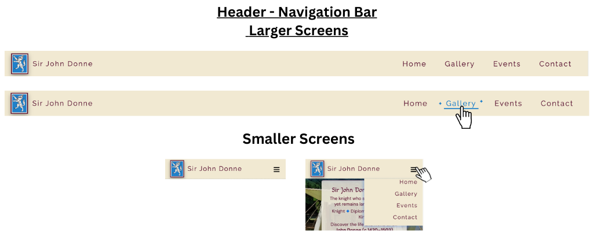

</details> <br>

The navigation bar Appears on all pages, and provides easy navigation between main sections: Home, Gallery, Events, Contact. There is a responsive with hamburger (drop down) menu on small screens.

**User Benefit:**  This feature enables visitors to navigate between pages without needing to return to the previous page using the browser back button. It improves usability across desktop and mobile devices.

**Notes / Feedback:** A logo or icon was suggested. The existing [favicon](assets/favicon/web-app-manifest-512x512.png) was already a suitable and readily available symbol, and it was adapted for use in this role.

### Footer
<!-- TODO: footer image -->
<details> <summary><strong>Footer</strong> (Click to expand)</summary>

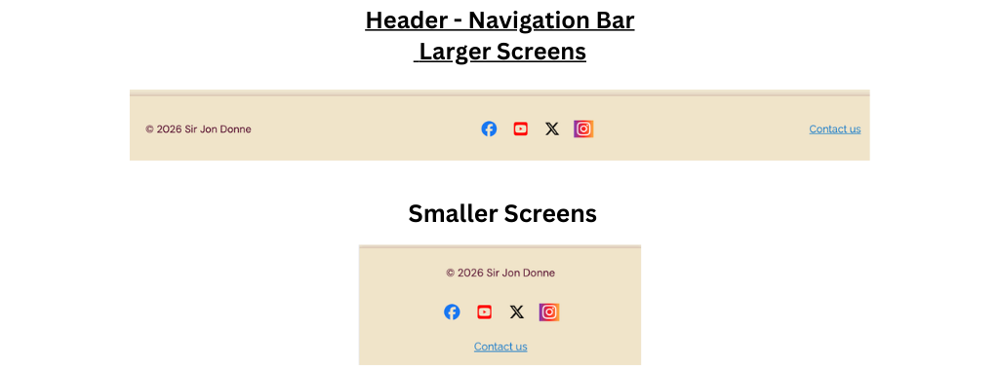

</details> <br>

The footer is present on all pages except 404 page. The footer contains navigation links, contact info, and related resources; M. Bass currently does not use any social media, therefore I have included examples of the most popular social media links, with each link opening to the respective main site webpage.

Due to varying screen sizes, the footer is not always immediately visible and may require the user to scroll to the bottom of the page to access it.

**User Benefit:** Provides consistent access to key information and navigation across the site, ensuring usability even when content extends beyond the initial viewport.

### Favicon & App Icons

The website includes multiple icon formats to ensure a consistent and professional appearance across all platforms, devices, and browsing contexts.

<details> <summary><strong>Classic Favicon</strong> (Click to expand)</summary>
<br>

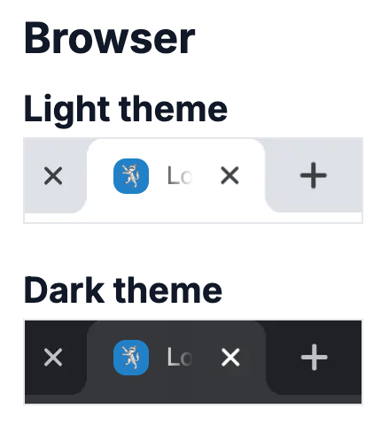

**Details:**  
- `favicon.ico` supports legacy browsers and Windows shortcuts (16x16, 32x32, 48x48).  
- `favicon-32x32.png` supports modern browsers and standard tabs.

**User Benefit:**  
- Provides clear identification of the site in browser tabs and bookmarks.  
- Improves usability by allowing users to quickly locate the site among multiple open tabs.  
- Ensures compatibility with older and modern browsers.  

</details><br>

<details> <summary><strong>Google Search Results</strong> (Click to expand)</summary>

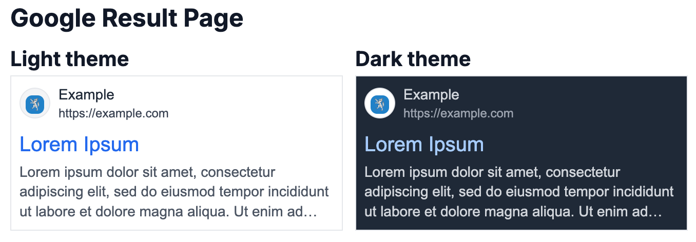

**Details:**  
- Search results display the favicon next to the page listing.  

**User Benefit:**  
- Increases brand recognition in search results.  
- Enhances credibility and trust, as a branded icon signals a maintained and professional site.  

</details><br>

<details> <summary><strong>Android Icons</strong> (Click to expand)</summary>

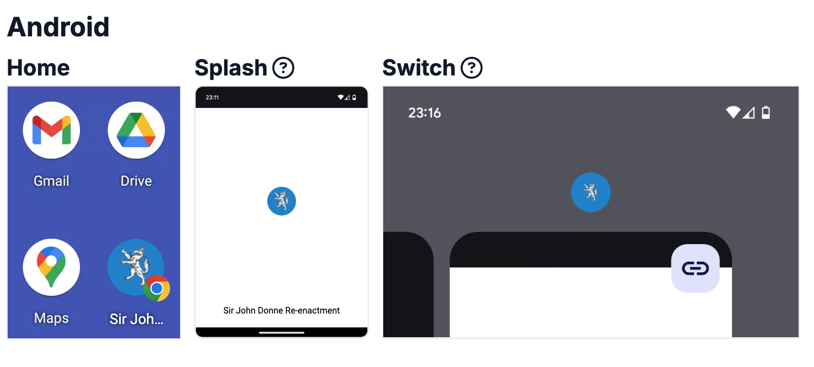

**Details:**  
- `android-chrome-192x192.png` – for Android home screen and Progressive Web Apps (PWA).  
- `android-chrome-512x512.png` – for Android splash screen and high-resolution displays.

**User Benefit:**  
- Allows users to add the website as a home screen shortcut for quick access.  
- Supports mobile engagement and PWA functionality.  
- Provides crisp and scalable images on high-density screens.  

</details><br>

<details> <summary><strong>Apple Touch Icons</strong> (Click to expand)</summary>
<br>

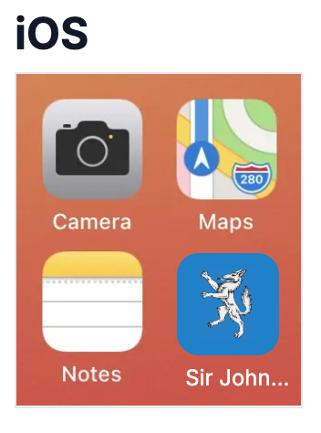

**Details:**  
- `apple-touch-icon.png` (180x180) is used for iOS home screens and Safari bookmarks.

**User Benefit:**  
- Users can easily save and access the site from an iPhone or iPad home screen.  
- Ensures the site appears clearly and professionally on iOS devices.  
- Improves mobile UX by providing a visually consistent experience across platforms.  

</details><br>

**UX Rationale:**  
Including multiple icon formats ensures that visitors have a **seamless and recognizable experience** across browsers, devices, and operating systems. It reinforces the site’s professional appearance, promotes brand consistency, and improves discoverability, whether users are browsing, bookmarking, or saving the site to their mobile devices.


### Landing / Home Page

<details> <summary><strong>Home/Landing Page image</strong> (Click to expand)</summary>
<br>

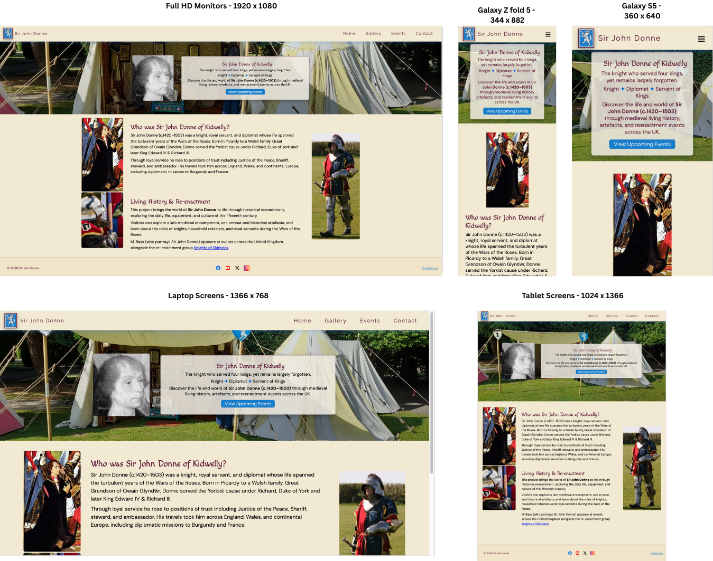
</details> <br>

Features:

- Large hero image with introductory text.
- Visual introduction to the re-enactment project.
- Explains historical context.
- Introduces the purpose of the website; being a re-enactment and living history site.
- Provides a clear entry point for visitors.
- encourages users to ecplore the site.

The landing page introduces users to the Sir John Donne re-enactment project.
It provides a clear visual introduction to the theme of the website and encourages users to explore further sections.
The main content sections explain the historical context of the re-enactment.

### Gallery Page

<details> <summary><strong>Gallery Page</strong> (Click to expand)</summary>

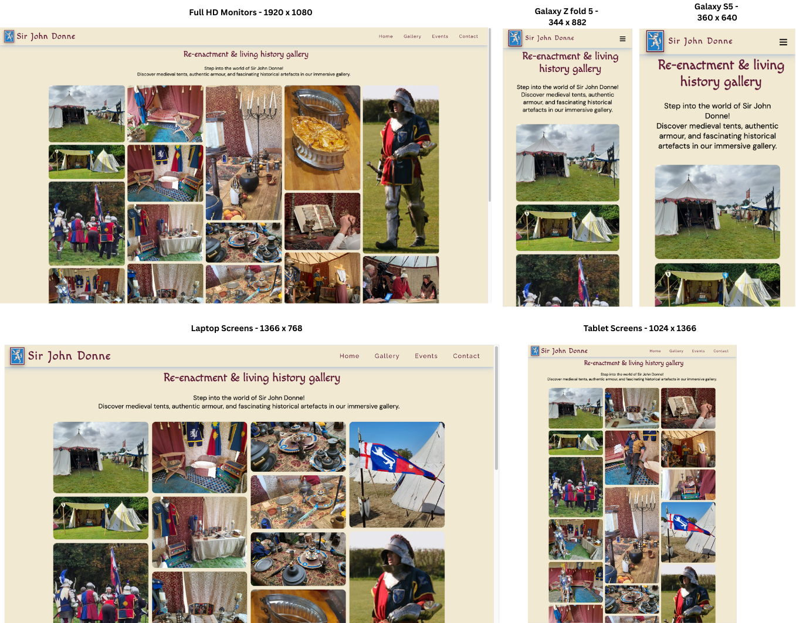
</details> <br>


**Features:**
- Displays supporting images related to the Sir John Donne re-enactment and historical items
- Provides clear visual context for objects and displays featured in the living-history tent
- Supports a structured and consistent layout with headings and captions for each image
- Fully responsive layout ensures images are accessible on desktop, tablet, and mobile devices

**User Benefit**: Visitors can visually explore historical items, gaining a better understanding of the re-enactment setup. Images support learning by providing immediate visual references and context for first-time and returning visitors. Gallery layout prioritises clarity and ease of navigation between images

**Notes**:
- Future enhancements could include lightbox functionality for larger image views or interactive descriptions
- Consistency with the site’s typography and colour scheme maintains a cohesive user experience

### Events page

<details><summary><strong>Events Page</strong> (Click to expand)</summary>

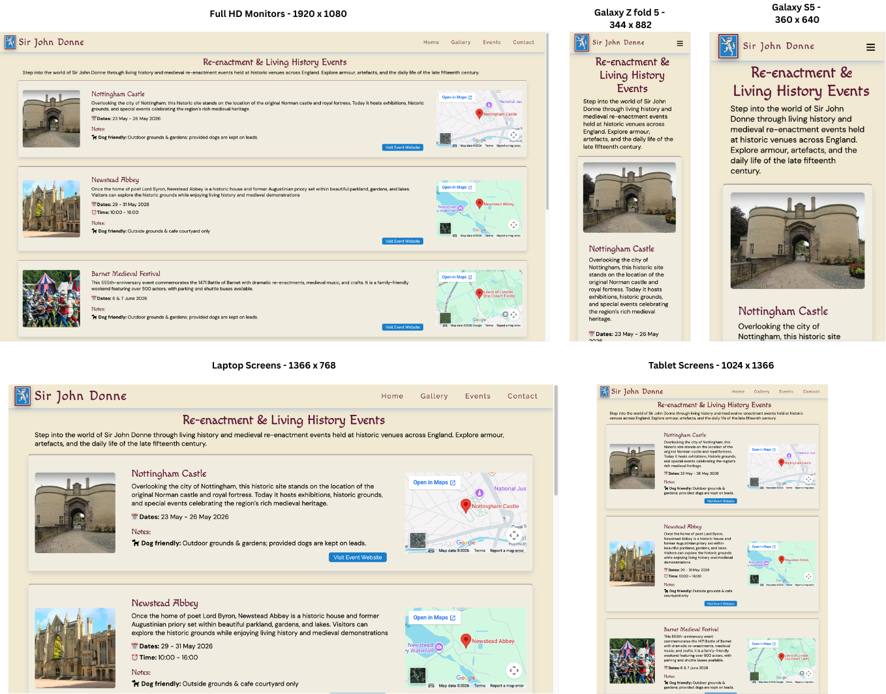
</details> <br>

**Features:**
- Lists upcoming historical re-enactment events, including location, date, and brief description.
- Provides links to venue pages or live event information where available.
- Helps users discover opportunities to experience the re-enactment display in person.
- Supports a structured layout for easy scanning of events.
- Fully responsive layout ensures usability on desktop, tablet, and mobile devices.

Links are intended to direct users to the relevant live event pages for each location, such as the [Barnet Medieval Festival](https://barnetmedievalfestival.wordpress.com/). In cases where a specific event page is not available, such as [Nottingham Castle](https://www.nottinghamcastle.org.uk/whats-on/), users are instead directed to the venue’s main “What’s On” or landing page.

**User Benefit**: Visitors can quickly find relevant events, understand where and when the re-enactment will take place, and plan their attendance. This supports both first-time and returning visitors in engaging with the Sir John Donne project.

**Notes / Feedback:**  
- External links open to official venue or event pages for accurate information.
- Consistent design ensures events list is visually aligned with other site pages.  
- Future enhancements could include calendar integration or interactive maps.

### Contact page

<details> <summary><strong>Contact Page</strong> (Click to expand)</summary>

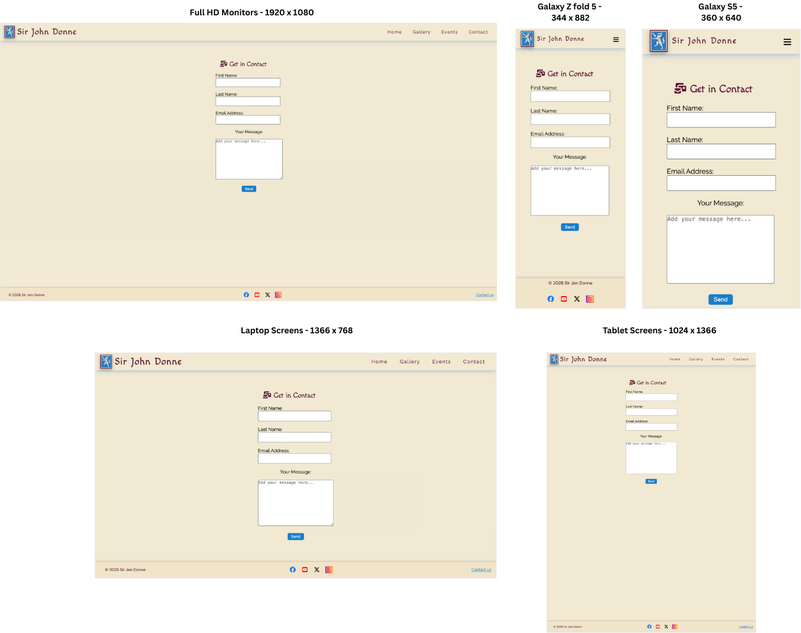
</details> <br>

Users can submit messages via a sign-up/contact form. 
The form requiers an @ symbol or will show the message is missing.

<details> <summary><strong>Error Message</strong> (Click to expand)</summary>

  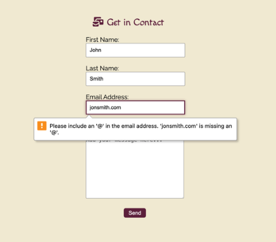
</details><br>

**Features:**
- Allows visitors to submit messages via a contact form
- After submission, users are redirected to a (*Message Sent*) confirmation page indicating that their message has been received.
- Structured form layout with clear input fields and labels
- Fully responsive design ensures accessibility on desktop, tablet, and mobile devices

**User Benefit**: Visitors can easily submit enquiries or questions about the re-enactment project, ensuring smooth communication with the site owner.

**Notes / Feedback:**  
- The contact form currently simulates submissions (front-end only) 
- Future improvements could include backend integration or styled email notifications  
- Consistent typography and colour scheme aligns with overall site design

### Message Sent Page

<details> <summary><strong>Message Sent Page</strong> (Click to expand)</summary>

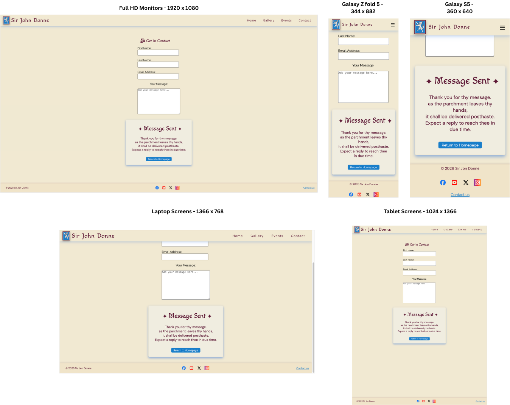
</details> <br>

**Description:**  

The *Message Sent* page appears after the Contact form is completed and the *Send* button is pressed. As this is a front-end-only project, the page simulates a successful email confirmation rather than submitting data to a backend service.

It provides clear visual feedback to the user that their message has been received, mimicking the behaviour of a fully functional contact form.

To maintain consistent navigation and reinforce user context, the Contact link remains active in the navigation bar:

```html
<li><a href="contact.html" class="active"><span>Contact</span></a></li>
```

I initially implemented [Web2phone](https://web2phone.co.uk/) to allow email and WhatsApp messages to be sent and received without backend functionality; Although this was functional, the solution relied entirely on external code, which could not be styled to match the rest of the site.  

As a result, I removed it in favour of the *Message Sent* page, which I coded myself. While this page is not functional, it simulates the behaviour of a successful form submission and demonstrates how a working contact form would behave. In the future, I can either implement a functional backend to make the contact form fully active or reintroduce Web2phone while adapting the styling to fit the site’s design.


**User Benefit**: The Immediate visual feedback on form submission builds confidence that messages are received successfully.

## 404 Error Page

404 Error Page
<details> <summary><strong>404 Error Page</strong> (Click to expand)</summary>

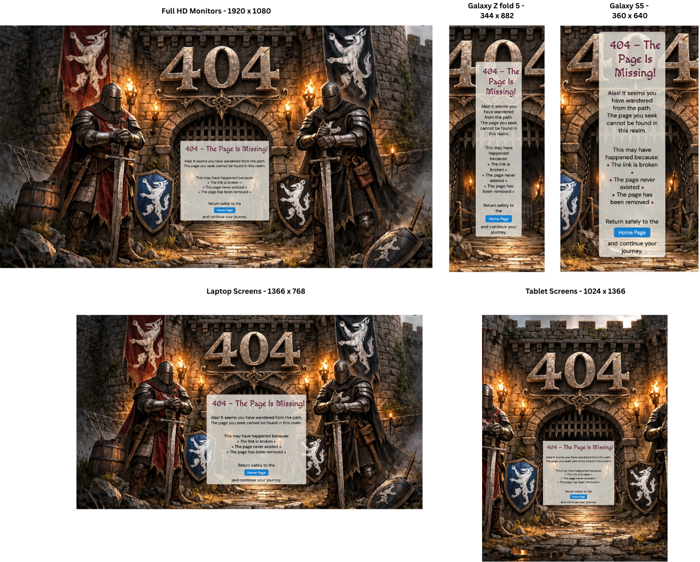

</details> <br>

**Features**:

- The 404 page appears when a user attempts to access a page that does not exist on the website;  clearly informing the user that the page they requested does not exist.
- The page informs the user that the requested page could not be found and provides clear navigation (through a a visible link/button) back to Home page.
- Uses the same header, footer, and site layout as other pages for consistency.
- Responsive design ensures the page works on desktop, tablet, and mobile devices.
- the 404 page maintains the same design elements to reinforce confidence.
- Designed to be _fun and engaging_, giving visitors a little surprise when they encounter it—adds personality to the site and encourages exploration.

**User Benefit**: 
- Helps visitors quickly recover from navigation errors without getting lost.
- Maintains consistent branding and design, reinforcing trust and usability.
- This helps prevent users from becoming lost on the site and improves the overall user experience by guiding them back to a valid page.

**Notes / Feedback**:
- Future enhancement could include a search bar or suggested links to popular pages.
- Currently static; could add an animated element or creative illustration to improve engagement.

### Features Left to Implement

<!-- TODO: List future pplanned features -->
Planned improvements for future versions of the site include:

- Historic Timeline / Timeline of Sir John Donne’s life.
  The timeline feature was explored during development but would require more complex interactive functionality. Since it involves multiple events across different time periods, it would be better implemented in a future version using JavaScript or Python. as well as additional detailed pages about Sir John Donne's Life

- FAQ section to answer common visitor questions.

- 360° tour photo / images in the tent.
Interactive 360° view inside the Re-enactment tent allowing users to explore the medieval tent and click objects and learn more about them.

External Feature Ideas:
- QR codes displayed at the re-enactment site that link directly to relevant sections of the website

## User Goals Mapping

The following features were designed to meet the needs of the target audience and user goals:

- **Navigation Bar**
  - Supports:
    - First-time visitors: navigate easily between pages
    - Returning visitors: quickly access specific sections
    - All users: maintain awareness of location within the site
    - All users: supports keyboard navigation and accessibility

- **Landing / Home Page**
  - Supports:
    - First-time visitors: understand the purpose of the site immediately
    - First-time visitors: learn about Sir John Donne
    - All users: establish trust through clear and structured content
    - All users: encourages exploration via visual hierarchy and prominent content sections

- **Gallery Page**
  - Supports:
    - First-time visitors: understand the historical items displayed
    - Target audience: engage with visual content to support learning
    - All users: future enhancements could include interactive descriptions or lightbox functionality to further engagement

- **Events Page**
  - Supports:
    - Returning visitors: find new or updated information
    - Returning visitors: discover future events
    - All users: identify clear next steps for attending events
    - All users: plan attendance easily with clear information and external links

- **Contact Page / Message Sent**
  - Supports:
    - Returning visitors: contact the site owner or re-enactment group
    - All users: receive immediate visual feedback on form submission, building confidence that messages are received
    - All users: access a structured and clear form layout

- **404 Error Page**
  - Supports:
    - First-time and returning visitors: quickly recover from navigation errors
    - All users: experience a fun, engaging, and playful page while maintaining trust
    - All users: maintain consistent site branding, layout, and design
    - Site owner goal: reinforce brand consistency and user engagement even on error pages

- **Clear Content Structure**
  - Supports:
    - First-time visitors: access important information quickly
    - All users: understand content easily and logically

- **Responsive Design**
  - Supports:
    - Site owner goal: ensure accessibility across devices
    - All users: access content on mobile, tablet, and desktop devices seamlessly

- **Accessibility Features**
  - Supports:
    - Site owner goal: provide an inclusive experience
    - All users: access content regardless of ability, including semantic HTML, alt text, sufficient contrast, and responsive layout

---

## User Benefit Summary Table

| Page / Feature        | Key Goals Supported                                           | User Benefits                                                                 |
|----------------------|---------------------------------------------------------------|-------------------------------------------------------------------------------|
| Navigation Bar        | First-time & returning visitors, accessibility               | Easy navigation, clear location awareness, keyboard-friendly                 |
| Landing / Home Page   | First-time visitors, all users                                | Immediate understanding of purpose, visual engagement, trust building        |
| Gallery Page          | First-time visitors, target audience                          | Visual exploration of historical items, supports learning                     |
| Events Page           | Returning visitors, all users                                  | Easy discovery of events, plan attendance, access relevant info quickly      |
| Contact / Message Sent| Returning visitors, all users                                  | Submit enquiries easily, receive immediate feedback, trust in site           |
| 404 Error Page        | First-time & returning visitors, all users, site owner       | Recover from errors quickly, engaging experience, maintains branding         |
| Clear Content Structure | First-time & all users                                        | Access information quickly, content is logical and easy to understand        |
| Responsive Design     | Site owner & all users                                         | Seamless experience on desktop, tablet, mobile devices                        |
| Accessibility Features| Site owner & all users                                         | Inclusive design, usable by people with visual/motor impairments, screen reader friendly |

<br>

[Back to top](#sir-john-donne-re-enactment)

---

## Technologies Used

### Languages

Languages used:

- HTML5  
- CSS3  

This project was built exclusively using HTML and CSS. No external libraries, frameworks (such as Bootstrap), or JavaScript were used.

### Tools

<!-- TODO: List tools and frameworks -->
The following table lists the key tools, resources, and references used during the development of this website.

| Resource | Purpose / How It Was Used |
|----------|---------------------------|
| [GitHub](https://github.com/) | Used for hosting and managing code repositories, version control, and collaboration.|
| [Google Fonts](https://fonts.google.com/) | Used to import the website’s typography, including DM Sans, Macondo, and Raleway fonts via CSS @import for headings, body text, and stylistic elements.|
| [Coolors](https://coolors.co/) | Coolors was used to develop and refine a visual colour palette, helping to establish the final hex colour scheme alongside M Bass. |
|[Canva](https://www.canva.com/online-whiteboard/wireframes/)| These skeleton wireframes were created using Canva, a tool for designing and arranging website layouts quickly and visually.|
| [Real Favicongenerator Generator](https://realfavicongenerator.net/your-favicon-is-ready) | Used to create website favicons, including .png, .ico, .svg, and Apple touch icons for browser tabs, bookmarks, and mobile home screens.|
| [Font Awesome](https://fontawesome.com/) | Used to source icons and interface elements throughout the website.|
| [Gradient Page](https://gradient.page/ui-gradients/instagram) | Used as a visual reference for implementing Instagram gradient styling.|
| [OpenReplay](https://openreplay.com/tools/rgba-to-hex/) | Used to convert RGBA 'color' values to hexadecimal format.|
| [Free Convert](https://www.freeconvert.com/jpg-to-webp/download) | Used to convert .JPG images to WebP format.|
| [To WebP](https://towebp.io) | Used to bulk convert .JPG images to WebP.|
| [Squoosh](https://squoosh.app/) | Used to compress image sizes without losing quality.|
| [VS Code](https://code.visualstudio.com) | Used as the main code editor for developing the website.|
| [Obsidian](https://obsidian.md) | Used for Markdown planning, note-taking, and documentation.|
| [MDN](https://developer.mozilla.org/) | Used for HTML & CSS referencing and syntax documentation. |
| [Google Maps](https://www.google.com/maps/) | Used to generate embed iframe code for an interactive map, allowing visitors to view the location directly on the website. |
|[Web2phone](https://web2phone.co.uk/)|I initially implemented this to allow email and WhatsApp messages to be sent and received without backend functionality; although this was functional, the solution relied entirely on external code, which could not be styled to match the rest of the site and was removed in favour of the _message sent_ page solution. |
| [Yujin Yeoh](https://yujinyeoh.com/website-mockup-generator?laptop=on&tablet=on&mobile=on&desktop=on&width=1024&preset=preset1&urlScreenshot=https%3A%2F%2Fdavid-cb-uk.github.io%2Fsir-john-donne-reenactment%2Fgallery.html) | Used to create responsive mockup images of my site on different devices. | 
| [Chat GPT](https://chatgpt.com/)| Used to generate 404 image based on a custom prompt. |
| [Am I Responsive](TBC)   |     | 
| [Lighthouse](TBC)   |     | 
| [WAVE](https://wave.webaim.org)| WAVE ( Web Accessibility Evaluation Tools) help to make web content more accessible to individuals with disabilities.|
| [TBC](TBC)   |     | 


## Project Structure

<!-- TODO: Add responsive mockup image -->

```text
project-root
│
├── index.html
├── gallery.html
├── events.html
├── contact.html
├── message-sent.html
├── 404.html
│
├── assets
│   ├── css
│   │   └── style.css
│   |
│   ├── favicons
│   │
│   └── images
│       ├── site-images
│       └── readme (images / resources)
│
└── README.md
```

[Back to top](#sir-john-donne-re-enactment)

---

## Testing

<!-- TODO: Explain your testing strategy -->
The website was tested across multiple screen sizes including:

- Desktop
- Tablet
- Mobile
The website was tested to ensure all features function correctly.

### Testing Strategy

Current testing focuses on existing pages and features, including navigation, forms, gallery, and responsiveness. 

Future features, such as the Historic Timeline and 360° Tent Tour, will require additional interactive testing once implemented. Planned tests will include:

- Interactive timeline events respond correctly to user input
- 360° tour allows smooth rotation and object selection
- QR codes link to the correct live pages

### Responsive Design

The layout uses responsive design principles to ensure the site functions effectively across mobile, tablet, and desktop devices.

<!-- TODO: Explain your testing strategy -->
Desktop view:

<!-- TODO: Explain your testing strategy -->
Mobile view:


### Manual Testing

<!-- TODO: Add responsive mockup image -->
- separate .md file??
<!-- TODO: Add responsive mockup image -->
- Navigation links
- Form submission
- Responsive layout on different screen sizes
- The website layout adapts to different screen sizes including mobile devices.

| Feature | Action | Expected Result | Result |
| --- | --- | --- | --- |
| Navigation | Click each link | Correct page loads | P?ass |
| Contact Form | Submit form | Redirect to thank you page | Pa?ss |
| Gallery | View images | Images load correctly | Pa?ss |
| Responsive layout | Resize browser | Layout adapts correctly | P??ass |

### Cross-Browser Testing

<!-- TODO: Add responsive mockup image -->
- Chrome
- Edge
- Safari

<!-- TODO: Add responsive mockup image -->

| Feature | Action | Expected Result | Result |
| --- | --- | --- | --- |
| Chrome | ?? | Correct page loads? | P/F?? |
| Edge | ?? | ?? | P/F?? |
| Safari | ?? | ?? | P/F?? |

### Validator Testing

#### HTML

<!-- TODO  -->
- No errors found using [W3C HTML Validator](https://validator.w3.org/)

#### CSS

<!-- TODO  -->
- No errors found using [W3C CSS Validator](https://jigsaw.w3.org/css-validator/)

### Lighthouse Testing

<!-- TODO  -->

### WAVE - Web Accessibility Evaluation Tools

WAVE identified one alert: a *redundant link*. This occurs because both the logo and the "Home" navigation link direct users to the homepage. No errors were found.

All pages passed both WCAG AA and AAA standards, with a contrast ratio of 8.59:1 and no contrast issues identified.

The features and structure review highlighted one minor issue on the Gallery page, where a heading level skipped from H2 to H4. This was subsequently corrected to H3.

<details> <summary><strong> </strong> WAVE - Home Page (Click to expand)</summary>


</details>

<details> <summary><strong> </strong> WAVE - Gallery Page (Click to expand)</summary>


</details>

<details> <summary><strong> </strong> WAVE - Events Page (Click to expand)</summary>


</details>

<details> <summary><strong> </strong> WAVE - Contact Page (Click to expand)</summary>


</details>

<!-- To add -->
CONTACT PAGE 2???

404 Page ????


### Unfixed Bugs

<!-- TODO  -->
- Minor layout shifts on very small screens???

[Back to top](#sir-john-donne-re-enactment)

---

## Deployment

<!-- TODO Explain how your site is deployed -->
The project was deployed using **GitHub Pages**.

Steps:

1. Navigate to the repository on GitHub
2. Click **Settings**
3. Navigate to **Pages**
4. Select the **main branch**
5. Save changes

The site will become available after a few minutes.

Live site link:  
<https://david-cb-uk.github.io/sir-john-donne-reenactment/>

[Back to top](#sir-john-donne-re-enactment)

---

## Credits

<!-- TODO: Add your content sources -->

- [Code Institute](https://codeinstitute.net/)  
  Course learning materials and walkthrough lessons were used as guidance during the development of this project.

- [Mimo](https://mimo.org/)
  An online learning mobile application that covers programming skills including as HTML, CSS, Flexbox etc.

- [Free Code Camp](https://www.freecodecamp.org/)
  An online learning platform that covers programming skills including as HTML, CSS, Flexbox etc.

- Community support  
  Community forums and discussions were referenced when resolving development issues.

- Duckett, J. (2011) *HTML and CSS: Design and Build  Websites*. Indianapolis: John Wiley & Sons.  
  Used as a general reference for HTML and CSS concepts when structuring and styling the website.

-

### Content

- [Code Drip](https://www.youtube.com/watch?v=LHyU-V2U2cI&utm_source=chatgpt.com) 
  Youtube tutorial to create Pinterest‑Like Layout with CSS‑only, without JavaScript.

### Media

<!-- TODO: Add your media sources -->
Images used in this project were sourced from:

- Re-enactor Mike Bass's own photographs.
- Many of the original historical items and images featured are over 500 years old and are not subject to copyright restrictions.  Acknowledgement and thanks are extended to the custodians of the respective museums and galleries.
- As a member of _The Knights of Skirbeck_, the _Wars of the Roses Federation_, and the _A Taste of Loyalty_ production team, M. Bass has access to and permission to use their official imagery as part of shared and collaborative ventures.
- Photographs of the event locations are taken from the venues’ official promotional materials.
- [404 Image](assets/images/404.webp) generated using [ChatGPT](https://chatgpt.com/) by OpenAI (2026) based on a custom prompt.

[Back to top](#sir-john-donne-re-enactment)

